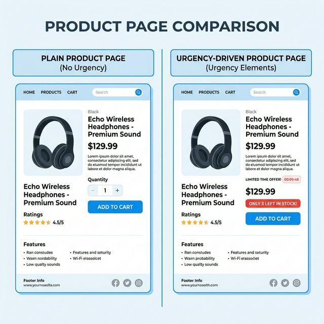
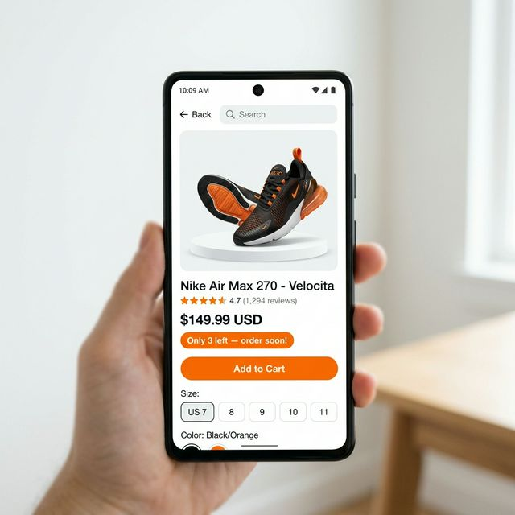
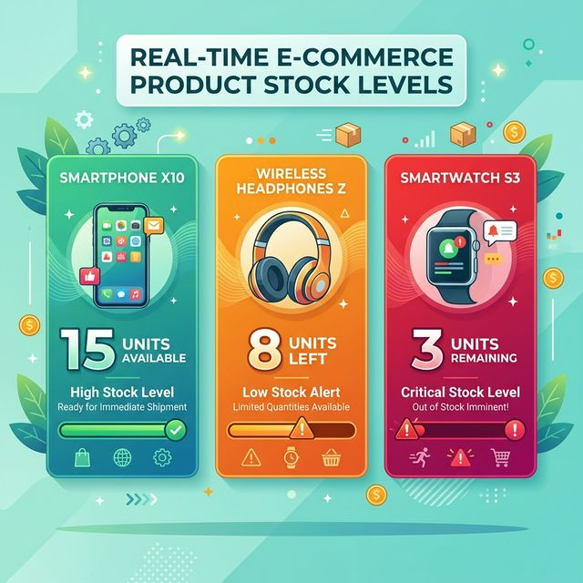

„Da komme ich später noch mal drauf zurück.“

Genau das denkt Ihr Besucher, wenn er Ihre Produktseite schließt, ohne zu kaufen. Und für die meisten kommt dieses „später“ nie. Sie werden abgelenkt, vergessen Ihre URL oder finden anderswo ein ähnliches Produkt.

Die Wahrheit ist: Die meisten Menschen zögern nicht, weil sie das Produkt nicht wollen. Sie zögern, weil sie keinen Grund sehen, *jetzt sofort* zu handeln. Es gibt keine Frist. Es gibt kein Gefühl, dass Warten riskant wäre.

Eine Bestandswarnung ändert das.

Wenn jemand bei einem Produkt, das er ohnehin in Erwägung zieht, *„Nur noch 4 auf Lager“* sieht, passiert im Gehirn etwas Vorhersehbares: Es wechselt von *„Will ich das?“* zu *„Was, wenn ich warte und es dann weg ist?“*

Das ist keine Manipulation. Sie zeigen lediglich eine zutreffende Information, die vorher nicht sichtbar war. Und es gehört zu den wirkungsvollsten und zugleich einfachsten Ergänzungen, die Sie Ihrem Shopify-Shop hinzufügen können.

---

## Die Psychologie hinter „Nur noch X übrig“

In der Psychologie gibt es ein gut untersuchtes Prinzip namens **Verlustaversion** — wir empfinden den Schmerz über einen Verlust etwa doppelt so stark wie die Freude über einen gleichwertigen Gewinn.

Für Ihren Shop heißt das: Die Angst, ein Produkt zu verpassen, das jemandem bereits gefällt, motiviert stärker als der Wunsch, es zu besitzen. Ein Besucher, der stöbert, verspürt leichtes Verlangen. Derselbe Besucher, der „Nur noch 2 übrig“ liest, verspürt leichte Angst. Angst konvertiert besser.

Der entscheidende Vorbehalt: Das funktioniert nur, wenn es stimmt. Künstliche Verknappung ist einer der schnellsten Wege, das Vertrauen eines Kunden dauerhaft zu verlieren. Wenn Ihr Zähler unabhängig vom tatsächlichen Bestand immer „noch 3 übrig“ anzeigt, werden aufmerksame Käufer das bemerken — und es weitererzählen.

Ist die Knappheit dagegen echt, gehört sie zu den wirksamsten Conversion-Werkzeugen, die Sie haben.

---

---

## So binden Sie Bestandswarnungen mit FomoGen ein

Hier die vollständige Einrichtung, Schritt für Schritt.

### Schritt 1: FomoGen installieren

Falls Sie FomoGen noch nicht nutzen, installieren Sie es über den [Shopify App Store](https://apps.shopify.com/fomogen) — kostenlos. Ist die App bereits installiert, öffnen Sie sie aus Ihrem Shopify-Admin.

### Schritt 2: Zu „Verknappung & Dringlichkeit“ wechseln

Klicken Sie im FomoGen-Dashboard in der linken Seitenleiste auf **Verknappung & Dringlichkeit**. Wählen Sie dann **Bestandswarnung** → **Neue Warnung erstellen**.

### Schritt 3: Bestandsschwelle festlegen

Das ist die Stückzahl, ab deren Unterschreitung die Warnung erscheint.

- **Für die meisten Shops:** 10 Einheiten
- **Für schnelldrehende Produkte:** 15–20 Einheiten
- **Für langsamdrehende oder hochwertige Artikel:** 3–5 Einheiten

Denken Sie aus Kundensicht. „Nur noch 10 übrig“ wirkt dringlich. „Nur noch 47 übrig“ nicht. Kalibrieren Sie die Schwelle so, dass die Warnung nur erscheint, wenn die Dringlichkeit echt ist.

### Schritt 4: Warntext formulieren

FomoGen nutzt eine einfache Vorlage, bei der `{count}` durch die tatsächliche Stückzahl ersetzt wird:

**Empfohlener Text:**
*„⚡ Nur noch {count} übrig — schnell bestellen!“*

Oder lockerer:
*„Fast ausverkauft — nur noch {count} verfügbar.“*

Halten Sie es kurz. Die Zahl erledigt den größten Teil der Arbeit. Schreiben Sie keinen Absatz.

### Schritt 5: Anzeigeort wählen

Wählen Sie die **Produktseite** als primäre Platzierung. Sie können die Warnung zusätzlich im **Warenkorb-Fenster** aktivieren — eine kluge Platzierung, weil sie Kunden erreicht, die den Artikel bereits hinzugefügt haben und womöglich noch mit dem Checkout hadern.

### Schritt 6: Produkte auswählen

Sie haben zwei Möglichkeiten:

- **Alle Produkte:** Die Warnung erscheint bei jedem Produkt, sobald der Bestand unter Ihre Schwelle fällt. Sinnvoll bei einem großen Sortiment.
- **Bestimmte Produkte:** Sie wählen gezielt aus, welche Produkte die Warnung erhalten. Sinnvoll für Ihre Bestseller oder Artikel, die Sie tatsächlich schnell abverkaufen wollen.

### Schritt 7: Gestalten und speichern

Wählen Sie Ihre Warnfarbe (Orange oder Rot schneidet in der Regel besser ab als neutrales Grau — warme Farben signalisieren Dringlichkeit ganz von selbst), klicken Sie auf **Speichern** und stellen Sie die Warnung auf **Aktiv**.

Öffnen Sie eine Ihrer Produktseiten in einem neuen Tab. Liegt der Bestand dieses Produkts unter Ihrer Schwelle, sehen Sie die Warnung sofort.

---

---

## Die richtige Schwelle finden: einige Beispiele

Unterschiedliche Produkte brauchen unterschiedliche Schwellenwerte. Hier eine praxistaugliche Orientierung:

**Alltagsprodukte mit hohem Volumen** (z. B. Handyhüllen, Kerzen, Basic-Kleidung):
Setzen Sie die Schwelle auf 15–20 Einheiten. Diese Artikel drehen schnell, und „Nur noch 18 übrig“ bei einem Produkt, das täglich 50-mal verkauft wird, ist für Kunden eine echt nützliche Information.

**Produkte mit mittlerem Volumen** (z. B. Hautpflege, Accessoires, Nischengeschenke):
Setzen Sie die Schwelle auf 8–12 Einheiten. Das ist die häufigste Konfiguration. Die Dringlichkeit ist real, und die Zahl ist niedrig genug, um Gewicht zu haben.

**Hochwertige Produkte mit geringem Volumen** (z. B. handgefertigte Artikel, limitierte Editionen, Schmuck):
Setzen Sie die Schwelle auf 3–5 Einheiten. Bei Artikeln, von denen Sie ohnehin nur wenige vorrätig haben, ist selbst „Nur noch 5 übrig“ ein starkes Signal. Diese Produkte profitieren oft am meisten von der Warnung.

**Dropshipping:** Wenn Sie im Dropshipping arbeiten und den Bestand nicht direkt steuern, setzen Sie die Warnung mit Bedacht ein — und nur bei Produkten, bei denen Sie den tatsächlichen Lagerbestand des Lieferanten sicher kennen. „Nur noch 2 übrig“ anzuzeigen, während der Lieferant 500 Stück hat, führt zu Erstattungsanfragen und Rückbuchungen.

---

## Was Sie nicht tun sollten

**Setzen Sie die Schwelle nicht so hoch, dass die Warnung immer sichtbar ist.**
Liegt Ihre Bestandsschwelle bei 50 Einheiten und Sie haben selten mehr als 60, sehen Kunden dauerhaft eine Verknappungswarnung. Nach ein paar Besuchen wirkt das unecht — selbst wenn es das nicht ist. Die Glaubwürdigkeit der Warnung hängt davon ab, dass sie die Ausnahme bleibt, nicht die Regel.

**Verwenden Sie keine alarmierende Sprache bei mittleren Beständen.**
„NUR NOCH 12 ÜBRIG — FAST AUSVERKAUFT — JETZT ZUGREIFEN!!!“ bei einem Produkt, das Sie wöchentlich nachbestellen, ist dem Geist nach unehrlich, selbst wenn die Zahl stimmt. Bleiben Sie sachlich und ruhig im Ton.

**Zeigen Sie sie nicht bei jedem Produkt und bei jedem Besuch.**
Wenn ein Kunde 10 Produkte ansieht und bei jedem einzelnen eine Bestandswarnung erscheint, durchschaut er das als Taktik statt als echtes Signal. Gehen Sie selektiv vor.

---

---

## Mit Social Proof zum vollständigen Conversion-Stack kombinieren

Eine Bestandswarnung beantwortet: *„Sollte ich jetzt handeln?“* — ja, denn es ist nicht mehr viel da.

Ein Verkaufs-Pop-up beantwortet: *„Kauft das sonst noch jemand?“* — ja, andere haben es gerade gekauft.

Eine fixierte In-den-Warenkorb-Leiste beantwortet: *„Wie kaufe ich?“* — indem Sie auf die Schaltfläche tippen, die immer erreichbar ist.

Laufen alle drei zusammen, entsteht eine Conversion-Umgebung, in der jeder zögernde Besucher seine Zweifel nacheinander ausgeräumt bekommt. Richtig gemacht wirkt das nicht aufdringlich — es wirkt wie ein gut geführter Laden.

FomoGen bringt alle drei in einer einzigen Installation mit. Der kostenlose Tarif erlaubt je eine Kampagne pro Typ, was zum Einstieg genügt, um Ergebnisse zu sehen, bevor Sie über ein Upgrade entscheiden.

> **Richten Sie Bestandswarnungen noch heute ein.** [FomoGen](/de/apps/fomogen) synchronisiert sich mit Ihrem echten Shopify-Bestand und zeigt authentische Verknappungssignale — keine gefälschten Timer, keine erfundenen Zahlen.
>
> **[FomoGen kostenlos bei Shopify installieren →](https://apps.shopify.com/fomogen)**

---

**Weiterlesen:** Jetzt, da die Dringlichkeit abgedeckt ist, lesen Sie, wie Sie [eine Versandkostenfrei-Leiste in Ihren Shopify-Shop einbinden](/de/blog/free-shipping-bar-shopify) und Kunden den letzten Anstoß geben, ihren Warenkorb aufzufüllen und den Kauf abzuschließen.
