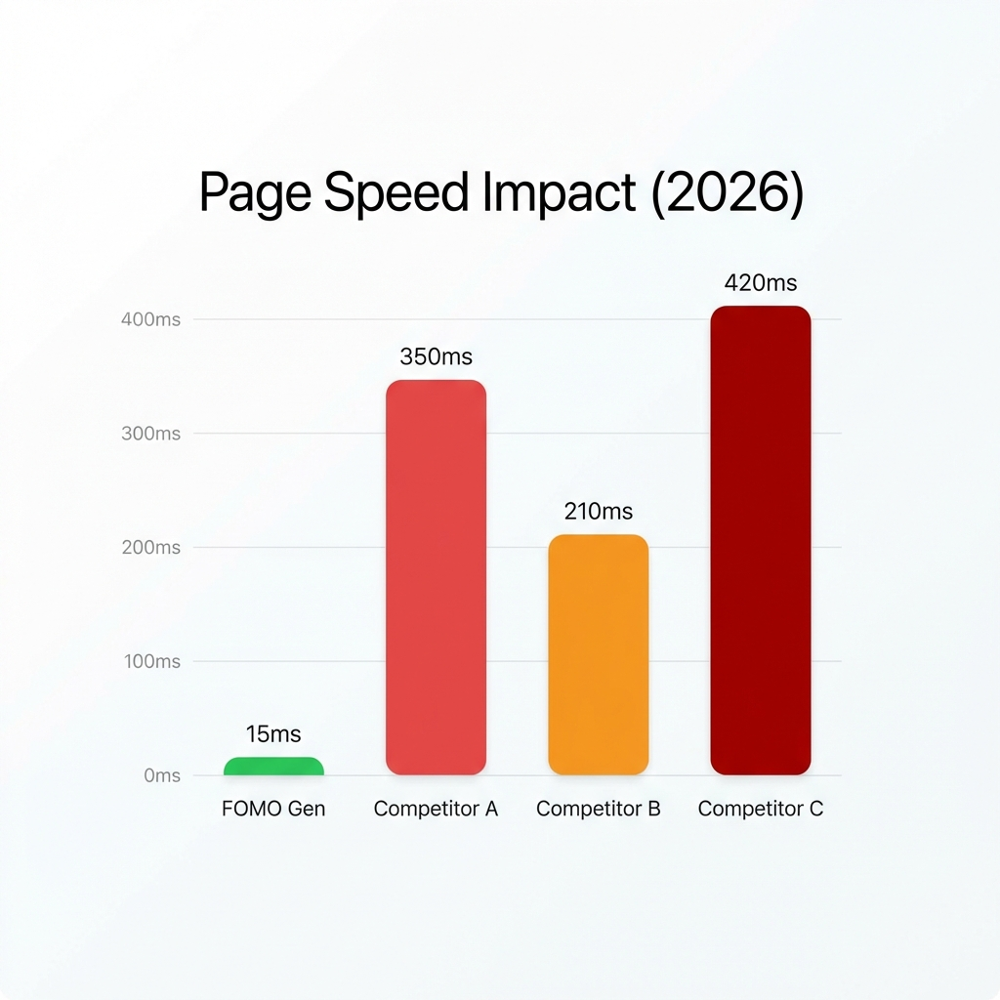

Wenn Sie einen Shopify-Shop betreiben, kämpfen Sie um Vertrauen. Untersuchungen zeigen: 92 % der Verbraucher zögern beim Kauf, wenn auf der Seite keine Bewertungen oder Social-Proof-Signale sichtbar sind. Sie brauchen eine App, die diese Lücke schließt.

Doch hier liegt das Problem: Der Shopify App Store ist überschwemmt von „Sales Pop“-Apps. Manche sind teure Enterprise-Werkzeuge, andere schlecht programmierte Skripte, die Ihre Core Web Vitals nach unten ziehen.

In diesem Leitfaden haben wir die 7 besten Social-Proof-Apps für 2026 getestet, damit Sie die finden, die Funktionen, Preis und Seitengeschwindigkeit ausbalanciert.

## 1. [FOMO Gen](https://apps.shopify.com/fomogen) (bestes Gesamtpaket aus Leistung und Tempo)

**Der All-in-One-Geschwindigkeitssieger**
Die meisten Händler machen den Fehler, eine App für Sales Pops, eine weitere für Trust-Badges und eine dritte für Sticky Carts zu installieren. Das führt zu „App Bloat“ und verlangsamt Ihre mobilen Ladezeiten.

FOMO Gen wurde gebaut, um genau das zu lösen. Die App bündelt die wesentlichen Conversion-Funktionen — Social Proof, Bestandsverknappung, Sticky Cart und Versandkostenfrei-Leisten — in einem einzigen, leichtgewichtigen App-Embed-Block.

**Wichtigste Funktionen:**

- **Sales Pops in Echtzeit:** Zeigen Sie aktuelle Bestellungen, um Vertrauen aufzubauen.
- **Bestandsverknappung:** Zähler nach dem Muster „Nur noch 3 übrig“, die FOMO auslösen.
- **Mobiler Sticky Cart:** Halten Sie die Kaufen-Schaltfläche in der „Daumenzone“ sichtbar.
- **Progressive Versandleiste:** Gamifizieren Sie Ihren Checkout und steigern Sie den durchschnittlichen Bestellwert (AOV).

**Pro:** Keine Auswirkung auf die Core Web Vitals; großzügiger kostenloser Tarif; ersetzt 4 andere Apps.
**Contra:** Neu am Markt (weniger Bewertungen als etablierte Apps).
**Preis:** Kostenloser Tarif verfügbar.

## 2. [Loox](https://apps.shopify.com/loox) (der visuelle Vertrauensbildner)

**Schöne Foto- und Videobewertungen**
Loox ist das Kraftpaket für visuellen Social Proof. Statt einfacher Text-Pop-ups ist die App darauf spezialisiert, Fotos und Videos von Kunden einzusammeln und darzustellen, um emotionales Vertrauen aufzubauen.

**Pro:** Hochwertige Widgets wie Karussells und Galerien; automatische E-Mails zur Bewertungsanfrage; Social-Proof-Upsells.
**Contra:** Exklusiv für Shopify. Der Preis skaliert mit dem Bestellvolumen, was für stark wachsende Shops teuer werden kann.
**Preis:** ab ca. 12,99 $/Monat.

## 3. [Nudgify](https://apps.shopify.com/nudgify) (die UX-Wahl)

**Verhaltensbasierte „Nudges“**
Nudgify verfolgt einen anderen Ansatz. Statt gewöhnlicher Pop-ups setzt die App auf „Nudges“, die auf Echtzeitdaten beruhen. Damit lassen sich gezielt kognitive Verzerrungen wie „Beliebtheit“ oder „Verknappung“ ansprechen.

**Pro:** Schöne, nativ wirkende Oberfläche, die nicht nach Spam aussieht.
**Contra:** Der Preis richtet sich häufig nach der Zahl der „angezeigten Benachrichtigungen“. Bei einem viralen Beitrag und plötzlichem Traffic können Sie Ihr Limit erreichen, und die Nudges hören abrupt auf zu funktionieren.

## 4. [Vitals](https://apps.shopify.com/vitals) (das Schwergewicht)

**40 Apps in einer**
Vitals ist ein Kraftpaket, das über 40 verschiedene Apps in einem Abo bündelt.

**Pro:** Sie bekommen alles, von Glücksrad-Pop-ups bis zum Währungsumrechner.
**Contra:** „Alleskönner, Meister von nichts.“ 40 verfügbare Funktionen können Ihr Dashboard überfrachten. Zudem kann der Betrieb zu vieler aktiver Module die Skriptausführungszeit auf Mobilgeräten spürbar verschlechtern.

## 5. [Rocket Sales Pop](https://apps.shopify.com/window-shoppers) (die Altbewährte)

**Der Klassiker der alten Schule**
Eine der meistinstallierten Apps der Shopify-Geschichte und ein fester Bestandteil im Dropshipping.

**Pro:** Riesige Nutzerbasis und vertrautes Design.
**Contra:** Bewertungen deuten darauf hin, dass Fehler gelegentlich Daten zurücksetzen können und die Oberfläche im Vergleich zu modernen Standards von 2026 angestaubt wirkt.

## 6. [SnapNoti](https://apps.shopify.com/snapnoti) (das leichtgewichtige All-in-One)

**FOMO und Dringlichkeit auslösen**
SnapNoti ist ein modernes, leistungsstarkes Werkzeug, das Besucherzähler, Verkaufs-Pop-ups und Bestandswarnungen in einer aufgeräumten Oberfläche vereint. Es ist als „einmal einrichten und vergessen“-Lösung für vielbeschäftigte Händler gedacht.

**Pro:** Enthält Tab-Animationen und eigene Layouts; Mehrsprachigkeit; sehr schnelle Ladezeiten.
**Contra:** Verfügt nicht über die tiefe Enterprise-Integrationsbibliothek größerer Anbieter wie Fomo.
**Preis:** Kostenloser Tarif verfügbar.

## 7. [Fomo](https://apps.shopify.com/fomo) (der Enterprise-Maßstab)

**Der Goldstandard für Social Proof**
Fomo bleibt die flexibelste und am besten integrierte Social-Proof-Plattform. Sie verarbeitet Millionen von Ereignissen und ermöglicht hochgradig personalisierte Benachrichtigungen, die in Echtzeit auf das Nutzerverhalten reagieren.

**Pro:** Über 100 Integrationen (Klaviyo, Mailchimp usw.); Pop-ups für Warenkorbabbrüche und Warenkorb-Zugänge; fortgeschrittene Geolokalisierung und Segmentierung.
**Contra:** Die Einrichtung kann komplex sein; die höchsten Tarifstufen bei großen Volumen sind teuer.
**Preis:** Kostenloser Tarif verfügbar (bis 1.000 Benachrichtigungen); kostenpflichtige Stufen ab 25 $/Monat.

## Das Conversion-Ökosystem

Dieser Leitfaden ist Teil unseres [ultimativen Leitfadens zur E-Commerce-Performance](/de/ecommerce-performance-2026-benchmarks). Meistern Sie die Kunst der Conversion unter 2,1 KB.

## Fazit

Wenn Sie die optisch beeindruckendsten Fotobewertungen wollen, wählen Sie **Loox**. Wenn Sie eine vollständige Integrations-Engine auf Enterprise-Niveau brauchen, führt **Fomo** das Feld an. Wenn Sie aber ein leichtgewichtiges, geschwindigkeitsoptimiertes Werkzeug wollen, das Ihnen Social Proof, Verknappung und Warenkorb-Optimierung kostenlos liefert, ist **FOMO Gen** 2026 die kluge Wahl.
