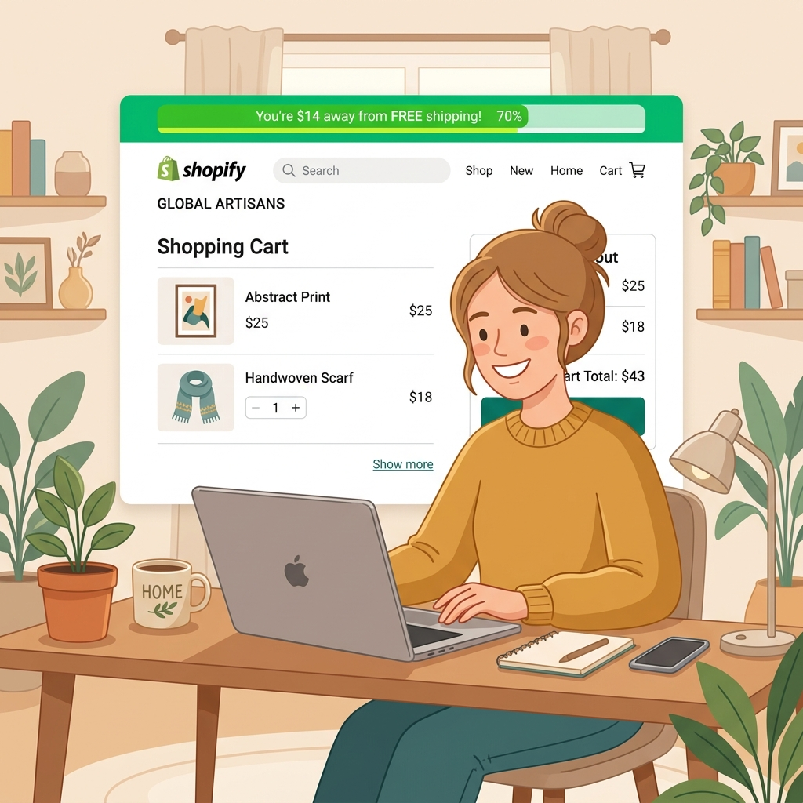
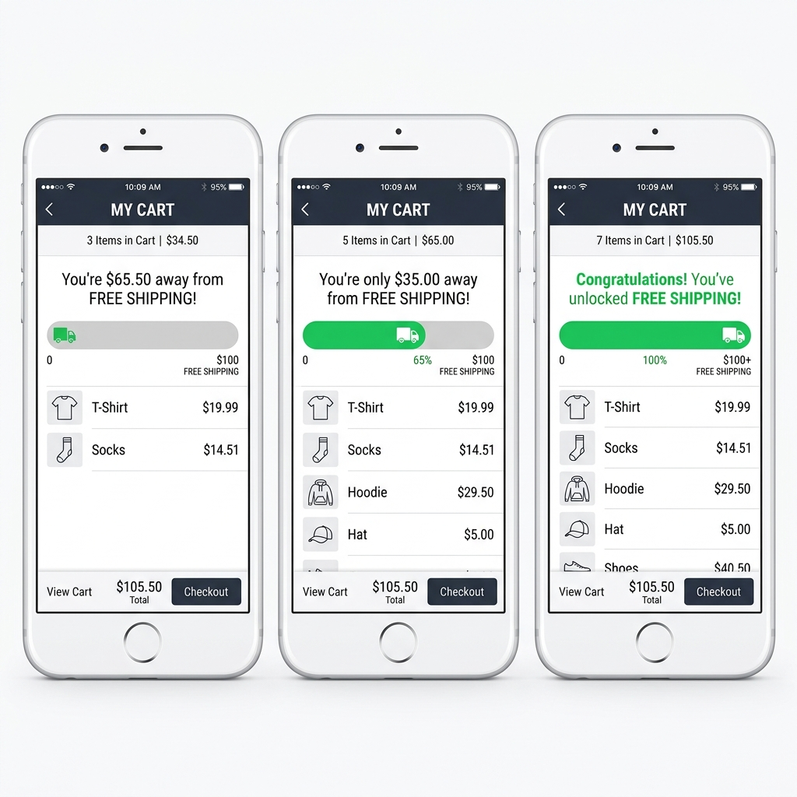
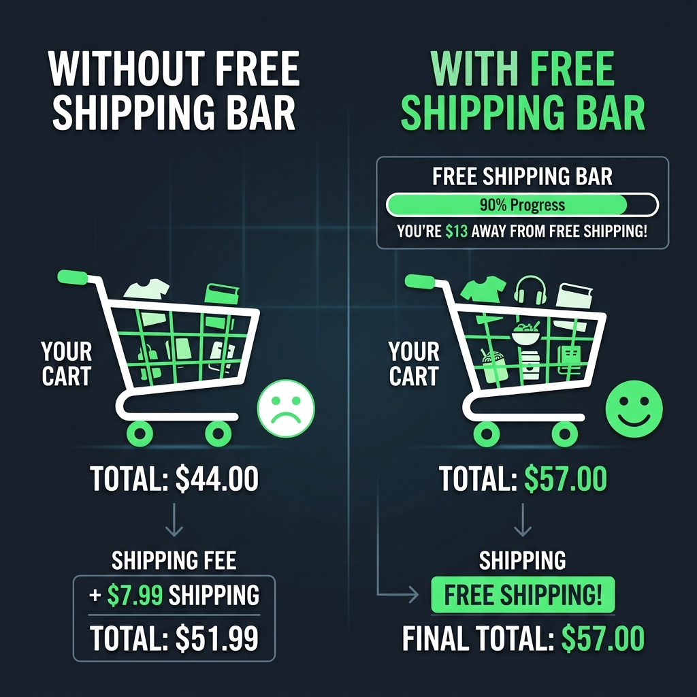

Folgendes passiert in fast jedem Onlineshop, jeden einzelnen Tag.

Eine Kundin hat Waren für 38 $ im Warenkorb. Ihr Schwellenwert für kostenlosen Versand liegt bei 50 $. Sie gelangt zur Kasse, sieht 6,99 $ Versandkosten und denkt: *„Hm. Vielleicht später.“*

Und sie geht.

Nicht, weil sie das Produkt nicht wollte. Nicht, weil der Preis falsch war. Nur weil diese Versandgebühr im denkbar schlechtesten Moment auftauchte — nachdem sie sich bereits zum Kauf entschlossen hatte — und sich wie eine Falle anfühlte.

Eine **Fortschrittsleiste für kostenlosen Versand** löst das, bevor es zum Problem wird. Statt die Versandkosten bis zur Kasse zu verstecken, stellen Sie das Angebot nach vorn: *„Noch 12 $ und der Versand ist kostenlos.“*

Es ist einer der einfachsten Erfolge im E-Commerce. Richten wir es ein.

---

## Warum Versandkostenfrei-Leisten so gut funktionieren

Es läuft auf zwei Dinge hinaus: Niemand mag überraschende Kosten, und alle mögen es, etwas Angefangenes zu Ende zu bringen.

**Das Problem der überraschenden Kosten** ist gut dokumentiert. Unerwartete Gebühren an der Kasse sind der häufigste Grund für Warenkorbabbrüche. Wenn eine Kundin Produkte für 38 $ sieht und an der Kasse 6,99 $ Versand aufgeschlagen bekommt, wirkt dieser Preisanstieg von 18 % unfair — selbst wenn der Gesamtpreis noch immer ein gutes Geschäft ist. Sie fühlt sich hereingelegt, auch wenn sie es nicht wurde.

Eine Versandkostenfrei-Leiste löst das, indem sie das Angebot von Anfang an sichtbar macht. Die Kundin kennt die Regeln, solange sie noch guter Dinge ist und Artikel in den Warenkorb legt.

**Der Effekt „etwas Angefangenes beenden“** wiegt sogar noch schwerer. Psychologen nennen ihn den *Endowed-Progress-Effekt* — wir sind deutlich motivierter, ein Ziel zu erreichen, wenn wir sehen, dass wir bereits Fortschritte gemacht haben. Eine zu 60 % gefüllte Leiste fühlt sich an wie etwas, in das man bereits investiert hat. Man will sie bei 100 % sehen.

Deshalb wirkt die Leiste besser, als bloß „Kostenloser Versand ab 50 $“ in die Kopfzeile zu schreiben. Der sichtbare Fortschritt lässt das Ziel erreichbar und persönlich wirken.

---

---

## Schritt für Schritt: Versandkostenfrei-Leiste mit FomoGen einbinden

### Schritt 1: FomoGen installieren

Falls noch nicht geschehen, installieren Sie [FomoGen aus dem Shopify App Store](https://apps.shopify.com/fomogen). Der Einstieg ist kostenlos, die Installation dauert etwa 60 Sekunden.

### Schritt 2: Funktion „Versandkostenfrei-Leiste“ öffnen

Klicken Sie in Ihrem FomoGen-Dashboard links in der Navigation auf **Versandkostenfrei-Leiste**. Wählen Sie dann **Neue Leiste erstellen**.

### Schritt 3: Schwellenwert festlegen

Das ist der wichtigste Schritt. Tragen Sie den Mindestbestellwert für kostenlosen Versand ein — er sollte dem Schwellenwert entsprechen, den Sie in Ihrem Shop tatsächlich anbieten.

Wenn Sie sich noch nicht auf einen Schwellenwert festgelegt haben, springen Sie zum Abschnitt weiter unten, in dem ich Ihnen zeige, wie Sie die richtige Zahl für Ihren Shop berechnen.

### Schritt 4: Ihre Texte formulieren

Mit FomoGen legen Sie drei verschiedene Meldungen fest, die in unterschiedlichen Phasen erscheinen:

**Startmeldung** (Warenkorb leer oder gering gefüllt):
Etwa: *„Ab 50 $ ist der Versand KOSTENLOS! 🚚“*

**Fortschrittsmeldung** (Warenkorb ist auf halbem Weg):
Diese ist die wichtigste. Nennen Sie den exakten Restbetrag:
*„Nur noch [Betrag] bis zum kostenlosen Versand!“*
FomoGen setzt den [Betrag] dynamisch ein, je nach Warenkorbinhalt.

**Erfolgsmeldung** (Schwellenwert erreicht):
*„Sie haben KOSTENLOSEN Versand freigeschaltet! 🎉“*

Bleiben Sie warm und locker im Ton — das ist eine Belohnung, kein Rechtshinweis.

### Schritt 5: Anzeigeorte wählen

Setzen Sie alle drei Häkchen:
- **Ankündigungsleiste** (oben auf jeder Seite)
- **Warenkorb-Fenster** (wenn jemand den seitlichen Warenkorb öffnet)
- **Warenkorbseite** (vor dem Checkout)

Je mehr Orte, desto wahrscheinlicher erreichen Sie den Kunden im richtigen Moment.

### Schritt 6: Passend zu Ihrem Shop gestalten

Wählen Sie Ihre Markenfarben für Füllung und Hintergrund der Leiste. Halten Sie es schlicht — die Leiste selbst ist die Hauptsache, nicht die Gestaltung drumherum.

### Schritt 7: Speichern und live schalten

Klicken Sie auf **Speichern** und stellen Sie die Leiste auf **Aktiv**. Öffnen Sie Ihren Shop in einem neuen Tab und legen Sie etwas in den Warenkorb — Sie sollten die Leiste sofort in Aktion sehen.

---

---

## So berechnen Sie den richtigen Schwellenwert

Hier machen die meisten Händler Fehler. Entweder setzen sie den Schwellenwert zu niedrig (und verschenken den Versand bei Bestellungen, die die Kosten nicht decken) oder zu hoch (dann wirkt das Ziel unerreichbar und wird ignoriert).

Diese Formel funktioniert:

**Schritt 1:** Ermitteln Sie Ihren aktuellen durchschnittlichen Bestellwert (AOV). Sie finden ihn in Shopify Analytics unter *Berichte → Verkäufe.*

**Schritt 2:** Multiplizieren Sie Ihren AOV mit 1,3. Das ist Ihr Ausgangsschwellenwert.

Liegt Ihr aktueller AOV also bei 42 $, setzen Sie den Schwellenwert auf **55 $**.

Warum das 1,3-Fache? Weil die meisten Kunden dann nah genug dran sind, dass ein kleiner Zusatzartikel genügt. Liegt der Schwellenwert zu weit über ihrem Warenkorbwert, geben sie es auf. Liegt er knapp unter ihrem natürlichen Ausgabeniveau, legen sie ebenfalls nichts dazu.

**Schritt 3:** Prüfen Sie Ihre Margen. Stellen Sie sicher, dass der Mehrumsatz aus der aufgestockten Bestellung Ihre durchschnittlichen Versandkosten deckt. Kostet der Versand 7 $ und Ihre Marge liegt bei 50 %, brauchen Sie 14 $ zusätzlichen Warenumsatz, um beim Versand die Null zu erreichen. Beim 1,3-Fachen fahren die meisten Shops im Plus.

Lassen Sie das 30 Tage laufen und prüfen Sie dann, ob sich Ihr AOV bewegt hat. Falls ja, rechnen Sie neu und heben Sie den Schwellenwert an.

---

## Ein konkretes Rechenbeispiel

Angenommen, Sie verkaufen Hautpflege. Ihr durchschnittlicher Bestellwert liegt bei 44 $, der Versand kostet Sie 6,50 $.

Sie setzen den Schwellenwert für kostenlosen Versand auf 57 $ (etwa das 1,3-Fache).

Vor der Leiste: Die meisten Kunden schließen bei 44 $ ab und zahlen 6,50 $ Versand. Ihnen bleiben 44 $ Warenumsatz.

Nach der Leiste: Kunden sehen, dass ihnen 13 $ zum kostenlosen Versand fehlen. Viele legen eine Reisegröße oder einen Lippenpflegestift dazu. Ihr Warenkorb liegt nun bei 57 $. Sie übernehmen den Versand (Kosten: 6,50 $), gewinnen aber 13 $ zusätzlichen Warenumsatz. Nettogewinn: 6,50 $ je aufgestockter Bestellung.

Bei 100 Bestellungen im Monat und einer Aufstockungsquote von nur 30 % sind das 195 $ Mehrumsatz pro Monat — durch eine kostenlose Leiste in Ihrem Shop. Solche Zahlen summieren sich schnell.

---

## Häufige Fehler, die Sie vermeiden sollten

**Den Schwellenwert zu hoch ansetzen.** Liegt Ihr AOV bei 35 $ und Ihr Schwellenwert bei 100 $, vermittelt die Leiste nur das Gefühl, dass man ohnehin nie gewinnt. Kunden ignorieren sie oder ärgern sich. Halten Sie das Ziel erreichbar.

**Sie nur auf der Warenkorbseite zeigen.** Die meisten Kunden erreichen die Warenkorbseite nie. Sie stöbern, entscheiden sich auf der Produktseite und springen dann entweder ab oder gehen direkt zur Kasse. Zeigen Sie die Leiste auf jeder Seite.

**Nach einer Rabattaktion vergessen, sie anzupassen.** Wenn Sie 20 % Rabatt geben und Produkte weniger kosten, müssen Kunden mehr Artikel hinzufügen, um denselben Schwellenwert zu erreichen. Senken Sie ihn während der Aktion vorübergehend oder weisen Sie deutlich darauf hin.

**Verwirrende Sprache verwenden.** „Kostenlose Zustellung bei Überschreiten des qualifizierenden Zwischensummen-Schwellenwerts“ ist ein schrecklicher Leistentext. Schreiben Sie wie ein Mensch: „Nur noch 8 $ bis zum kostenlosen Versand!“ — mehr braucht es nicht.

---

---

## Mit Social Proof kombinieren für noch bessere Ergebnisse

Die Versandkostenfrei-Leiste sagt Kunden, *was zu tun ist* (mehr in den Warenkorb legen). Social Proof sagt ihnen, *warum es sicher ist* (andere kaufen ebenfalls). Zusammen entsteht eine Shop-Umgebung, in der Kaufen die naheliegende, selbstverständliche Handlung ist.

Sobald Ihre Versandkostenfrei-Leiste läuft, gehen Sie zurück in FomoGen und aktivieren Sie Ihr **Verkaufsbenachrichtigungs**-Pop-up. Die Kombination aus „andere kaufen gerade“ und „Sie sind nah am kostenlosen Versand“ gehört zu den wirksamsten Conversion-Kombinationen, die Sie in einem Shopify-Shop einsetzen können.

> **Sie wollen das heute noch einrichten?** [FomoGen](/de/apps/fomogen) enthält eine Versandkostenfrei-Fortschrittsleiste, Verkaufsbenachrichtigungen, Sticky Cart und Bestands-Countdowns — kostenlos im Einstieg, alles in einer einzigen Installation mit 2,1 KB.
>
> **[FomoGen kostenlos bei Shopify installieren →](https://apps.shopify.com/fomogen)**

---

**Weiterlesen:** Erfahren Sie, wie Sie Ihre Versandkostenfrei-Leiste mit [Bestandswarnungen](/de/blog/add-low-stock-alerts-shopify) kombinieren, die bei Ihren Bestsellern Dringlichkeit erzeugen — beide Werkzeuge bringen stöbernde Kunden gemeinsam in den Kaufmodus.
