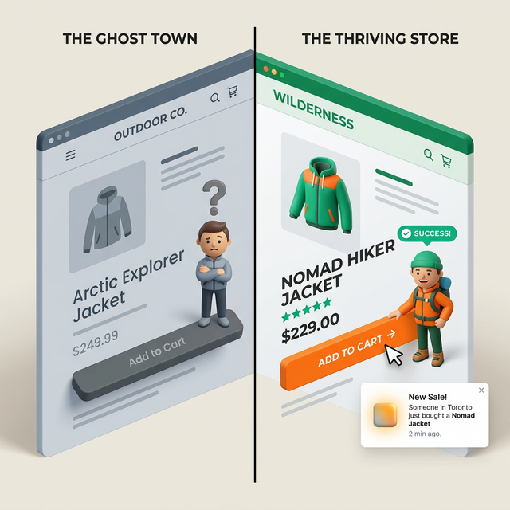
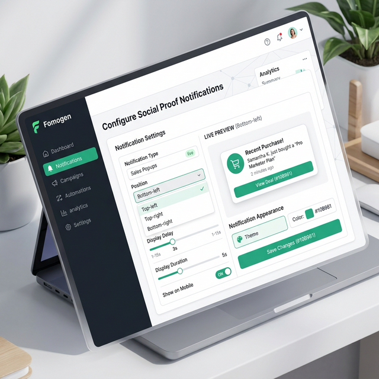
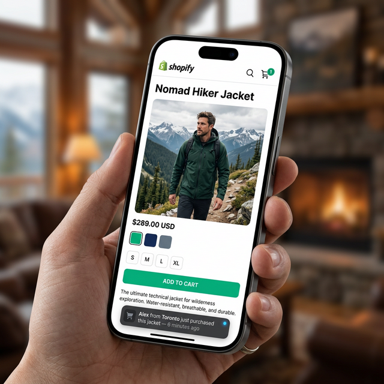

Sie haben Besucher in Ihrem Shop. Sie klicken sich durch, sehen sich Ihre Produkte an. Und dann … gehen sie wieder, ohne zu kaufen.

Kommt Ihnen das bekannt vor?

Einer der größten Gründe, warum Besucher nicht kaufen, ist simpel: Sie sind sich nicht sicher, ob andere überhaupt kaufen. Ihr Shop mag großartige Produkte führen — doch fehlt jedes Lebenszeichen, keine Bewertungen, keine Aktivität, kein Beleg dafür, dass echte Menschen hier bestellen, dann legt das Gehirn Ihres Besuchers das stillschweigend unter „riskant“ ab.

Eine Verkaufsbenachrichtigung ändert das. Es ist das kleine Widget, das in der Ecke Ihres Shops erscheint und Dinge sagt wie *„Sarah aus New York hat gerade die Classic Leather Bag gekauft — vor 4 Minuten.“*

Es funktioniert, weil es echt ist. In diesem Leitfaden zeige ich Ihnen genau, wie Sie so etwas kostenlos und in rund 5 Minuten in Ihren Shopify-Shop einbinden.

---

## Warum Ihre Besucher sehen müssen, dass andere kaufen

Denken Sie an das letzte Mal, als Sie an einem Restaurant vorbeigegangen sind. In welches wollten Sie eher hinein — in das volle, belebte oder in das völlig leere?

Ihr Shopify-Shop funktioniert genauso.

Wenn jemand zum ersten Mal in Ihrem Shop landet, ist er ein Fremder. Er kennt Sie nicht. Er fragt sich: *Ist das seriös? Wird wirklich geliefert? Kauft hier sonst noch jemand?*

Eine Verkaufsbenachrichtigung beantwortet alle drei Fragen in einem kurzen Moment. Sie sagt: Ja, dieser Shop ist aktiv, echte Menschen haben gerade etwas gekauft — und zwar vor Kurzem.

Psychologen nennen das **Social Proof** — wir orientieren uns am Verhalten anderer, um einzuschätzen, was sicher ist. Deshalb zeigt Amazon auf Produktseiten „1.200 Personen haben das im letzten Monat gekauft“. Deshalb kleben Restaurants „Beliebteste Wahl“ auf Speisekarten.

Sie brauchen dafür nicht Amazons Budget. Sie brauchen nur die richtige Shopify-App.

---

---

## Was eine gute Verkaufsbenachrichtigung zeigt

Nicht alle Pop-ups sind gleich. Ein gutes enthält:

- **Vorname + Stadt** des Käufers (z. B. „Emma aus Chicago“)
- **Produktname** und optional ein kleines Produktvorschaubild
- **Zeit seit dem Kauf** (z. B. „vor 12 Minuten“)
- **Ein dezentes Design**, das Ihren Hauptinhalt nicht verdeckt

Ein schlechtes zeigt erfundene Namen, erfundene Orte oder einen Timer, der sich bei jedem Neuladen zurücksetzt. Besucher bemerken das 2026 — und sobald sie es tun, sind sie weg.

---

## Schritt für Schritt: Verkaufsbenachrichtigung mit FomoGen einbinden

So richten Sie es von Grund auf ein. Das dauert etwa 5 Minuten.

### Schritt 1: FomoGen installieren

Gehen Sie in den [Shopify App Store](https://apps.shopify.com/fomogen) und suchen Sie nach **FomoGen**. Klicken Sie auf „App hinzufügen“ und folgen Sie der Installation. Die Installation ist kostenlos, mit einem großzügigen Gratis-Tarif.

### Schritt 2: FomoGen-Dashboard öffnen

Klicken Sie nach der Installation in Ihrem Shopify-Admin auf „App öffnen“. Sie landen im FomoGen-Dashboard. Klicken Sie in der linken Seitenleiste auf **Social-Proof-Benachrichtigungen**.

### Schritt 3: Erste Kampagne erstellen

Klicken Sie auf **Neue Kampagne** und vergeben Sie einen Namen (etwa „Pop-up für aktuelle Käufe“). Wählen Sie **Verkaufsbenachrichtigung** als Kampagnentyp.

FomoGen zieht Ihre echten Shopify-Bestelldaten automatisch heran — es ist keine manuelle Einrichtung nötig. Jedes Mal, wenn jemand in Ihrem Shop bestellt, kann dieser Kauf im Pop-up erscheinen.

### Schritt 4: Aussehen anpassen

Sie können ändern:

- **Position** — unten links wird empfohlen
- **Farben** — passend zu Ihrer Marke
- **Anzeigeverzögerung** — wie viele Sekunden nach dem Laden der Seite die Anzeige erscheint (3–5 Sekunden sind ein guter Startwert)
- **Abstand zwischen Benachrichtigungen** — wie lange zwischen zwei Pop-ups vergeht (8–12 Sekunden funktionieren gut)
- **Welche Informationen erscheinen** — Name, Stadt, Produkt, Zeit

Halten Sie es aufgeräumt. Quetschen Sie nicht zu viel Text in das Widget.

### Schritt 5: Bestellzeitraum festlegen

Wählen Sie unter **Dateneinstellungen**, wie weit zurück Bestellungen herangezogen werden. Erhält Ihr Shop regelmäßig tägliche Bestellungen, stellen Sie **Letzte 24 Stunden** ein. Sind Sie ein neuerer Shop mit geringerem Volumen, sind **Letzte 7 Tage** in Ordnung.

Das ist wichtig. Einen Kauf von vor 6 Monaten mit dem Hinweis „vor 183 Tagen“ anzuzeigen, hilft Ihnen nicht. Bleiben Sie aktuell und glaubwürdig.

### Schritt 6: Speichern und aktivieren

Klicken Sie auf **Speichern** und stellen Sie die Kampagne auf **Aktiv**. Das war's. Öffnen Sie Ihren Shop und warten Sie 3–5 Sekunden — Ihr Pop-up sollte erscheinen.

---

## Das richtige Timing finden

Der größte Fehler bei Verkaufsbenachrichtigungen ist, sie zu aufdringlich auszuspielen. Ein Pop-up, das in der Sekunde erscheint, in der jemand Ihre Startseite öffnet, wirkt wie Spam. Es ist, als würde Sie eine Verkäuferin ansprechen, kaum dass Sie den Laden betreten haben.

Ein Timing, das sich natürlich anfühlt:

- **Verzögerung des ersten Pop-ups:** 4 Sekunden nach dem Laden der Seite
- **Abstand zwischen Pop-ups:** 10 Sekunden
- **Maximale Pop-ups pro Sitzung:** 3–4

So hat der Besucher Gelegenheit, sich umzusehen, bevor er angestupst wird — und wird nicht im Sekundentakt bombardiert.

---

## Was tun, wenn Sie noch wenige Bestellungen haben?

Das ist bei neuen Shops eine berechtigte Sorge. Wenn Sie erst 2–3 Bestellungen haben, schadet ein Verkaufs-Pop-up womöglich mehr, als es nützt, weil es dieselben zwei Namen immer wieder zeigt.

In dem Fall haben Sie zwei Möglichkeiten:

1. **Erweitern Sie den Bestellzeitraum auf 30 Tage** — so haben Sie mehr Daten zum Durchwechseln
2. **Verzichten Sie vorerst auf das Verkaufs-Pop-up und nutzen Sie stattdessen einen Besucherzähler** — „14 Personen sehen sich dieses Produkt gerade an“ erzeugt ähnliche Dringlichkeit, ganz ohne Kaufhistorie

FomoGen unterstützt beides. Sobald Ihr Bestellvolumen wächst, wechseln Sie zur Verkaufsbenachrichtigung.

---

---

## Die Geschwindigkeitsfrage: Schadet das meinem PageSpeed-Score?

Das ist die häufigste Sorge von Händlern vor der Installation einer Conversion-App — und das zu Recht: Viele Pop-up-Apps sind aufgebläht und verlangsamen den Shop spürbar.

FomoGen wurde gezielt so gebaut, dass genau das nicht passiert. Die App nutzt das **App-Embed-Block**-System von Shopify, das heißt:

- Sie schleust keine Skripte in Ihren `<head>`-Bereich
- Sie lädt **nach** dem Hauptinhalt Ihrer Seite, nicht davor
- Ihre gesamte Payload liegt unter 2,1 KB

Zur Einordnung: Ein einzelnes Produktbild in niedriger Auflösung wiegt in Ihrem Shop typischerweise 50–200 KB. Das komplette Skript von FomoGen ist kleiner als 2,1 KB. In Ihrem PageSpeed-Insights-Bericht wird es nicht als Problem auftauchen.

---

## Mit Verknappung kombinieren für maximale Wirkung

Ein Verkaufs-Pop-up sagt Besuchern, dass andere kaufen. Ein **Bestandszähler** sagt ihnen, dass sie *jetzt* kaufen sollten. Zusammen sind sie eine starke Kombination.

Sobald Ihre Verkaufsbenachrichtigung steht, kehren Sie zu FomoGen zurück und aktivieren Sie für Ihre Topseller ein **Bestandsverknappungs-Widget**. Ein Hinweis wie *„Nur noch 4 auf Lager“* neben der Anzeige aktueller Käufe erzeugt eine echte Dringlichkeit, die die Rate der Warenkorb-Zugänge spürbar hebt.

> **Bereit, Social Proof in Ihren Shop zu bringen?** [FomoGen](/de/apps/fomogen) enthält Verkaufsbenachrichtigungen bereits im kostenlosen Tarif — dazu Bestands-Countdowns, Sticky Cart und Versandkostenfrei-Leisten, alles in einer einzigen leichtgewichtigen Installation.
>
> **[FomoGen kostenlos bei Shopify installieren →](https://apps.shopify.com/fomogen)**

---

**Als Nächstes:** Erfahren Sie, wie Sie [den optimalen Schwellenwert für kostenlosen Versand berechnen](/de/blog/calculate-free-shipping-threshold) — und wie Sie ihn als dynamische Fortschrittsleiste anzeigen, die Ihren durchschnittlichen Bestellwert erhöht.
