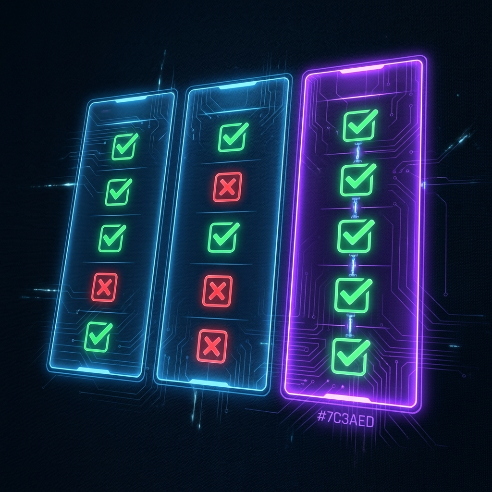

Als ich anfing, meine „Dopaminschleifen“ in den Griff zu bekommen, erschlug mich die Auswahl. Jede App versprach, „mein Leben zu retten“ — aber als Entwickler wollte ich sehen, was technisch unter der Haube steckt. Ich musste wissen, welche Werkzeuge bloß „weiche“ Wellness-Apps sind und welche echte „[kognitive Firewalls](/de/apps/mindful-guard)“.

Damit Sie sich das Ausprobieren sparen können, habe ich diesen Vergleich aus meiner eigenen Recherche zu den Marktführern zusammengestellt.

## Die Logikmatrix

| Merkmal                       | MindfulGuard          | Opal                   | Freedom                  | AppBlock               |
| :---------------------------- | :-------------------- | :--------------------- | :----------------------- | :--------------------- |
| **Grundphilosophie**          | Logische Präzision    | Ästhetisches Wohlbefinden | Geräteübergreifende Synchronisierung | Einfache Einschränkung |
| **Datenschutzarchitektur**    | Zero-Telemetry        | Cloud-Analysen         | Server-synchronisiert    | Datengetrieben (Werbung) |
| **Performance-Auswirkung**    | Logik ohne Auswirkung | Hoch (VPN-Latenz)      | Mäßig                    | Mäßig bis hoch         |
| **Grad der Strenge**          | Unumgehbare Logik     | Leicht zu umgehen      | Mäßige Reibung           | Hoch (Strikter Modus)  |
| **Preis**                     | Transparent/fair      | ~99 $/Jahr             | ~40 $/Jahr               | Freemium               |

> **Sie wollen die interaktive Fassung?** Sehen Sie sich den [vollständigen Vergleich auf der MindfulGuard-Seite](/de/apps/mindful-guard#comparison) an.

## Warum die Architektur entscheidend ist

### Das Datenschutzproblem

Ich war überrascht, dass Opal auf einen VPN-basierten Ansatz setzt. Das bedeutet, dass Ihr Datenverkehr über deren Systeme läuft. Ich habe [MindfulGuard](/de/apps/mindful-guard) bewusst „Offline-First“ gebaut, denn Ihre Konzentration sollte nicht auf Kosten Ihrer Daten gehen.

### Die Akkuentladung

Viele Android-Nutzer stellen fest, dass ihr Telefon mit Apps wie AppBlock schneller leer wird. Wir haben MindfulGuard mit „Mikrosekunden-Performance“ entwickelt, damit die App unsichtbar läuft, ohne Ihre Ressourcen zu verbrauchen.

### Die „Willenskraft“-Falle

Viele ältere Apps wie Freedom wirken sperrig oder frustrierend. Entweder sperren Sie sich versehentlich selbst aus — oder, schlimmer, die App bietet Ihnen einen bequemen Ausweg, sobald es anstrengend wird. Wir haben uns auf den „Strikten Logikmodus“ konzentriert, um die Ausrede „5 Minuten mehr“ ein für alle Mal zu beseitigen.

## Meine abschließende Empfehlung

Wenn Sie kreativ arbeiten und zwischen Mac und PC synchronisieren müssen, ist **Freedom** eine solide Wahl. Wenn Sie das „Influencer“-Erlebnis wollen und Ihnen der Preis von 99 $ pro Jahr nichts ausmacht, ist **Opal** sehr hübsch.

Wenn Sie aber Entwicklerin, Ingenieur oder Studentin sind und ein Werkzeug brauchen, das auf aggressiven Android-Oberflächen „einfach funktioniert“, ohne Sie zu tracken, brauchen Sie eine andere Art von Logik.

---

**Bereit für die logische Entscheidung?**

[MindfulGuard installieren](https://play.google.com/store/apps/details?id=com.anonymous.mindfulguard&referrer=utm_source%3Dapplass%26utm_medium%3Dblog%26utm_campaign%3Dlogic-comparison-matrix%26utm_content%3Dinline) | [Den vollständigen Vergleich ansehen](/de/apps/mindful-guard)
