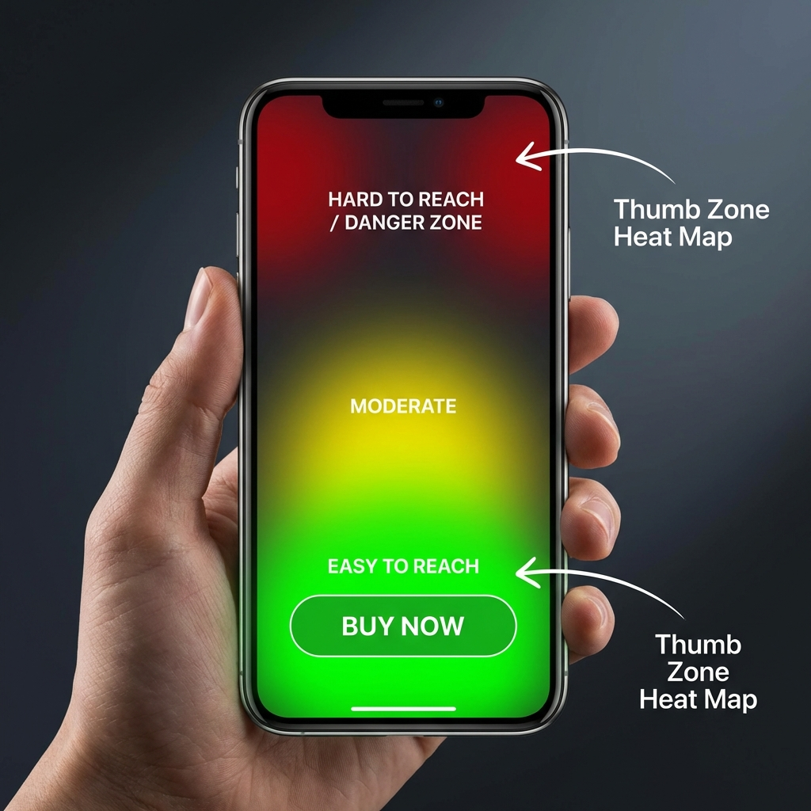

Wir leben in einer Mobile-First-Welt. 79 % der Smartphone-Nutzer haben in den letzten 6 Monaten auf ihrem Gerät eingekauft. Dennoch liegen die mobilen Conversion-Raten (2,1 %) weiterhin deutlich unter denen am Desktop (3,5 %). Warum? **Reibung.**

Am Desktop ist die Schaltfläche „In den Warenkorb“ meist durchgehend sichtbar. Auf dem Smartphone verschwindet sie, sobald der Nutzer nach unten scrollt, um Bewertungen oder Beschreibungen zu lesen. Entscheidet er sich dann zum Kauf, muss er den ganzen Weg zurückscrollen. Dieser Sekundenbruchteil an Aufwand genügt für einen „Mikro-Abbruch“.

## Die Wissenschaft der „Daumenzone“

UX-Forschende teilen den Handybildschirm in Zonen ein, je nachdem, wie leicht Nutzer sie einhändig erreichen.

- **Die sichere Zone:** die untere Bildschirmmitte (leicht erreichbar).
- **Die Gefahrenzone:** die oberen Ecken (schwer erreichbar).

Die meisten Shopify-Themes platzieren die Warenkorb-Schaltfläche oben (Gefahrenzone). Eine **fixierte In-den-Warenkorb-Leiste** löst das, indem sie die Schaltfläche am unteren Bildschirmrand verankert (**der sicheren Zone**). Sie ist immer erreichbar, immer sichtbar und liegt direkt unter dem Daumen.

## Diese Ergebnisse können Sie erwarten

1. **Weniger Reibung:** Kein Scrollen mehr nötig, um zu kaufen.
2. **Höhere Klickrate:** Die Fixierung erhöht die Sichtbarkeit Ihres Call-to-Action (CTA).
3. **Bessere Daten:** Der Sticky Cart von FOMO Gen bringt eine Auswertung mit, sodass Sie genau sehen, wie viele Klicks aus der fixierten Leiste kommen und wie viele aus der Hauptschaltfläche.

## Über die Schaltfläche hinaus

Sticky Carts sind erst der Anfang. Die vollständige Conversion-Architektur finden Sie in unserer [Themenseite zur E-Commerce-Performance](/de/ecommerce-performance-2026-benchmarks).

## Aktionsplan

Lassen Sie mobile Besucher nicht abspringen, weil sie die Schaltfläche nicht finden. Ein Sticky Cart ist eine Optimierung nach dem Prinzip „einmal einrichten und vergessen“, die sich sofort auszahlt.

> **🚀 Bereit, Ihre Conversions zu steigern?** [FomoGen](/de/apps/fomogen) bringt einen Sticky Cart von Haus aus mit — dazu Social Proof, Countdown-Timer und Bestandswarnungen, alles in einer Payload unter 2,1 KB.
>
> **[FomoGen bei Shopify installieren →](https://apps.shopify.com)**
