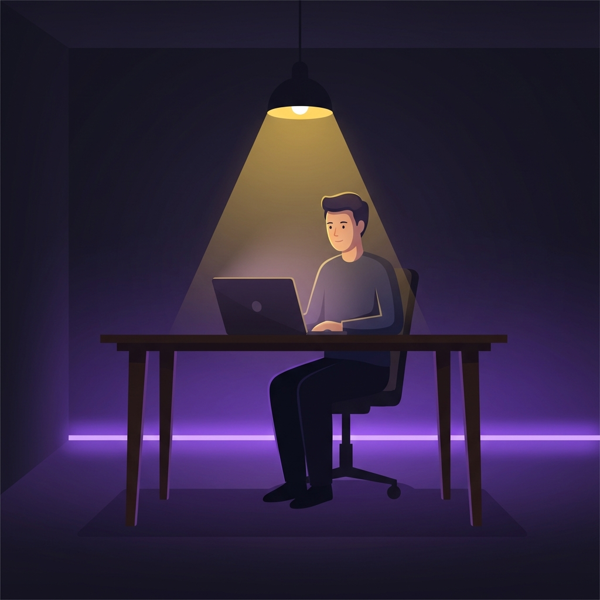

Lange Zeit dachte ich, beim „Monk Mode“ ginge es einfach darum, härter zu sein. Ich redete mir ein: Wenn ich es nur genug _wollte_, könnte ich aufhören, ständig aufs Handy zu schauen. Aber ich scheiterte immer wieder. Mitten in einem großen Projekt öffnete mein Daumen bereits eine App, ohne dass ich auch nur darüber nachgedacht hätte.

Mir wurde klar: Ich kämpfte nicht gegen mangelnde Disziplin — **ich kämpfte gegen ein Latenzproblem.**

## Das 20-ms-Geheimnis: Warum Ihr Daumen schneller ist als Ihr Gehirn

Die einfache Wahrheit, die ich gefunden habe: Menschliche Willenskraft ist langsam. Bis Ihr bewusstes Gehirn sagt „Hey, mach das nicht auf“, hat die Gewohnheit längst gewonnen. Social-Media-Algorithmen sind darauf gebaut, Inhalte in Millisekunden zu laden — schneller, als Sie sich überhaupt zum Aufhören entscheiden können.

Ich habe jahrelang „weiche“ Wellness-Apps wie Opal und Freedom ausprobiert, aber sie wurden meinen Ansprüchen als Power-User nicht gerecht:

- **Der Preis:** Opal war unglaublich teuer und verlangte bis zu 99 $ pro Jahr, nur damit ich konzentriert bleibe.
- **Die Sperrigkeit:** Freedom fühlte sich wie eine Desktop-App an, die nicht so recht auf mein Android-Telefon passte — frustrierend im Alltag.
- **Die Datenschutz-Warnsignale:** Manche Apps blockierten den Datenverkehr über ein VPN, was mich beunruhigte, weil meine Daten über ihre Server liefen.

> **Die vollständige Aufschlüsselung:** Unsere [Vergleichsmatrix](/de/apps/mindful-guard#comparison) zeigt genau, wie MindfulGuard gegenüber der Konkurrenz abschneidet.

## Eine „kognitive Firewall“ bauen

Ich beschloss, Konzentration nicht länger als „Gefühl“ zu behandeln, sondern als Ingenieursaufgabe. Ich wollte ein System bauen, das schneller ist als meine eigenen Impulse — eine „[kognitive Firewall](/de/apps/mindful-guard)“ für mein Gehirn.

So entstand [MindfulGuard](/de/apps/mindful-guard). Es sollte nicht bloß ein weiterer Timer sein, sondern ein Stück Infrastruktur, das auf Android-Telefonen mit aggressivem Energiemanagement (etwa Xiaomi oder Samsung) tatsächlich funktioniert, ohne von den Akku-Einstellungen beendet zu werden.

## Die drei Regeln von Monk Mode 2.0

Damit mein Monk Mode hält, habe ich drei konkrete Funktionen in die App eingebaut:

1. **Strikter Logikmodus:** Keine Schaltfläche „5 Minuten mehr“. Sobald die Sperre steht, ist sie eine harte Wand, die Willenskraft nicht durchbrechen kann.
2. **Zero-Telemetry-Datenschutz:** Ich bin Entwickler und deshalb besessen von Datenschutz. Meine App arbeitet Offline-First — Ihre Nutzungsdaten bleiben auf Ihrem Telefon, nicht in einer Cloud.
3. **Reibungstraining:** Manchmal braucht es einfach eine Pause. Wir schieben ein paar Sekunden Atmen oder eine Verzögerung ein, um die „Dopaminschleife“ zu durchbrechen, bevor sie beginnt.

## Das Ergebnis: Ich habe meinen Tag zurück

Seit ich diesen „logikbasierten“ Ansatz nutze, habe ich rund **2,4 Stunden pro Tag** zurückgewonnen. Ich habe aufgehört, mich wegen fehlender Willenskraft schuldig zu fühlen — weil ich endlich ein Werkzeug hatte, das schneller ist als meine Ablenkungen.

Hören Sie auf, mit bloßen Händen gegen einen Supercomputer zu kämpfen. Es ist Zeit, ein System einzusetzen, das wirklich funktioniert.

### Meistern Sie Ihre neuronale Architektur

Dieser Artikel ist Teil unseres [ultimativen Leitfadens für digitales Wohlbefinden](/de/digital-wellness-2026-guide). Entdecken Sie die vollständige Themenseite für weitere Einblicke in Monk Mode und Fokus-Engineering.

---

**Bereit für Monk Mode 2.0?**

[MindfulGuard installieren](https://play.google.com/store/apps/details?id=com.anonymous.mindfulguard&referrer=utm_source%3Dapplass%26utm_medium%3Dblog%26utm_campaign%3Dmonk-mode-willpower%26utm_content%3Dinline) | [Die Logik entdecken](/de/apps/mindful-guard)
