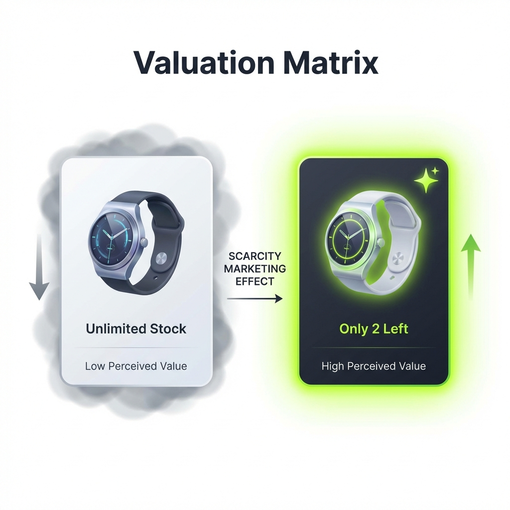

Haben Sie schon einmal ein Hotelzimmer gebucht, nur weil auf der Website stand: „Nur noch 1 Zimmer zu diesem Preis verfügbar!“? Das war keine rationale Entscheidung. Es lag an einem biologischen Auslöser namens **Verlustaversion**.

In der Psychologie beschreibt Verlustaversion die Tatsache, dass der Schmerz über einen Verlust psychologisch doppelt so stark wiegt wie die Freude über einen gleich großen Gewinn.

Für Shopify-Händler ist das Verständnis dieses Auslösers der Schlüssel zu höheren Conversion-Raten, ohne mehr Geld für Werbung auszugeben.

## Die Heuristik der Verknappung

Ist ein Produkt reichlich vorhanden, schieben wir die Entscheidung auf. Wir denken: „Das kaufe ich später.“ Ist ein Produkt knapp, schaltet unser Gehirn in den Überlebensmodus. Wir denken: „Ich muss es jetzt kaufen, sonst ist es für immer weg.“

Genau deshalb sind Bestands-Countdowns so wirksam.

**Die Kennzahl:** Social Proof und Verknappungshinweise in Echtzeit können die Conversions um bis zu 98 % steigern.

**So setzen Sie es ein:** Schreiben Sie nicht bloß „Auf Lager“. Nutzen Sie [FomoGen](/de/apps/fomogen), um einen dynamischen Zähler anzuzeigen: _„Schnell sein! Nur noch 3 Stück auf Lager.“_

## Soziale Bestätigung: der Effekt „Sicherheit in der Gruppe“

Menschen sind Herdentiere. Wir orientieren uns an anderen, um zu bestimmen, was sicher und richtig ist. Das nennt sich **Social Proof**. Landet ein Besucher in Ihrem Shop und sieht dort keinerlei Aktivität, entsteht „Checkout-Angst“. Ist das ein Betrug? Wird überhaupt geliefert?

Wenn Sie eine Verkaufsbenachrichtigung einblenden — „Amanda aus Texas hat das vor 2 Minuten gekauft“ —, liefern Sie eine externe Bestätigung. Sie sagen dem Unterbewusstsein des Besuchers: „Andere kaufen das. Es ist sicher. Schließen Sie sich an.“

## Die Ethik von FOMO

**Achtung:** Künstliche Verknappung zerstört Vertrauen. Verbraucher sind 2026 aufgeklärt. Wenn Sie einen Countdown-Timer zeigen, der sich bei jedem Neuladen zurücksetzt, werden sie merken, dass Sie lügen.

- **Richtig:** Werkzeuge nutzen, die sich mit Ihrem tatsächlichen Shopify-Bestand synchronisieren.
- **Falsch:** „Fake“-Zähler einsetzen, die immer „noch 3 übrig“ anzeigen, obwohl 1.000 Stück auf Lager liegen.

## Die Wissenschaft hinter dem psychologischen ROI

Verstehen Sie, wie sich FOMO in eine umfassendere Strategie zur [E-Commerce-Performance](/de/ecommerce-performance-2026-benchmarks) einfügt.

## Zusammenfassung

Sie müssen Kunden nicht manipulieren. Sie müssen lediglich die Wahrheit sichtbar machen. Ist Ihr Bestand knapp, sagen Sie es. Kaufen gerade andere, zeigen Sie es. Das ist der Kern von wirksamem und zugleich ethischem Marketing.

**Empfohlener nächster Schritt:** Verbinden Sie FOMO-Psychologie mit der richtigen UX. Sehen Sie, wie ein [mobiler Sticky Cart](/de/blog/mobile-sticky-cart-guide) Ihren Conversion-Trichter stärkt.
