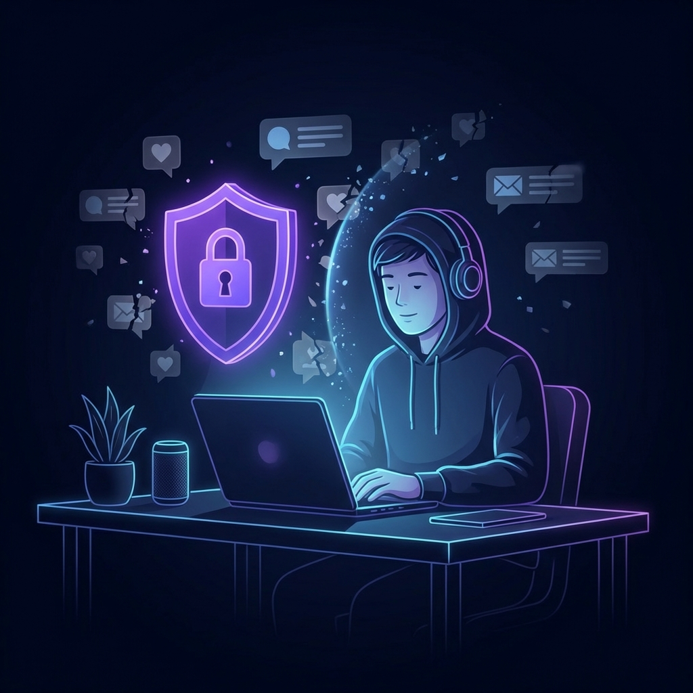

Früher wachte ich jeden Morgen mit einem großen Ziel auf: Ich wollte etwas Großartiges für das AppLass-Ökosystem bauen. Doch gegen 10:00 Uhr fand ich mich meist in einer „Dopaminschleife“ wieder und scrollte durch Feeds, die mich nicht einmal interessierten.

Mir wurde klar, dass ich einen ungleichen Kampf führte: Mein Gehirn lief mit „Legacy-Code“ (meiner eigenen Willenskraft), während Social-Media-Apps Supercomputer-Algorithmen einsetzten, die aufs Gewinnen ausgelegt sind.

**Der Preis war nicht nur „verlorene Zeit“, sondern der Verlust von rund 2,4 Stunden — jeden einzelnen Tag**, die ich in meine Apps hätte stecken können.

## Das gebrochene Versprechen der „Konzentration“

Ob Sie als Studentin lernen, als Entwickler programmieren oder als Unternehmerin wachsen wollen — das Problem ist dasselbe: **Ihre Konzentration ist eine Systemressource, die permanent angegriffen wird.**

- **Die Angestellte:** Schon eine einzige Benachrichtigung kann Ihren „Flow“ für 23 Minuten zerstören.
- **Der Student:** Es ist nahezu unmöglich, komplexe Mathematik oder Technik zu lernen, wenn Mikro-Unterbrechungen das Gehirn zerstückeln.
- **Die Unternehmerin:** Kluge Entscheidungen gelingen nicht, wenn Sie unter Entscheidungsmüdigkeit durch „Doomscrolling“ leiden.

## Ich habe die „weichen“ Lösungen ausprobiert (sie sind gescheitert)

Ich habe monatelang Apps wie Opal und Freedom getestet, aber es hat sich nie richtig angefühlt:

- Manche waren **viel zu teuer** für das, was sie boten
- Andere wollten meine privaten Daten über ein VPN durch ihre Server leiten
- Am schlimmsten: Die meisten waren „weich“ — ich konnte auf „5 Minuten mehr“ tippen und meine eigenen Ziele umgehen

Als Entwickler wusste ich, dass ich etwas mit **mathematischer Präzision** und **Zero-Telemetry-Datenschutz** brauchte.

> **Neugierig, wie die Alternativen abschneiden?** Sehen Sie sich unsere [detaillierte Vergleichsmatrix](/de/apps/mindful-guard#comparison) an und erfahren Sie, warum VPN-basierte Blocker zu kurz greifen.

## Die Lösung: eine „kognitive Firewall“ bauen

Deshalb habe ich [MindfulGuard](/de/apps/mindful-guard) entwickelt. Ich wollte keine „Wellness“-App — ich wollte ein Werkzeug, das nach derselben Logik arbeitet wie eine Firewall für einen Computer.

- **Strikter Logikmodus:** Sobald eine Sperre gesetzt ist, gibt es keine Umgehung. Das beseitigt die Ausreden und hält Sie auf Kurs.
- **Datenschutz ohne Tracking:** Ihre Daten verlassen Ihr Telefon nie, denn Konzentration sollte privat sein.
- **Native Performance:** Die App läuft unsichtbar im Hintergrund, ohne Ihren Akku zu leeren — selbst auf Android-Geräten mit aggressivem Energiemanagement.

## Nicht härter kämpfen — klüger arbeiten

Ich habe aufgehört, mich „mehr anzustrengen“, und stattdessen ein System eingesetzt, das die Arbeit für mich erledigt. Mit einer logischen Leitplanke habe ich endlich meine neuronale Bandbreite zurückgewonnen.

## Teil des Frameworks für digitales Wohlbefinden

Die eigene Konzentration zurückzugewinnen ist eine systemische Aufgabe. Sehen Sie, wie sich diese Strategie in unseren [ultimativen Leitfaden für digitales Wohlbefinden](/de/digital-wellness-2026-guide) einfügt.

---

**Bereit, Ihre Konzentration zurückzuholen?**

[MindfulGuard installieren](https://play.google.com/store/apps/details?id=com.anonymous.mindfulguard&referrer=utm_source%3Dapplass%26utm_medium%3Dblog%26utm_campaign%3Dreclaim-focus-story%26utm_content%3Dinline) | [So funktioniert es](/de/apps/mindful-guard)
