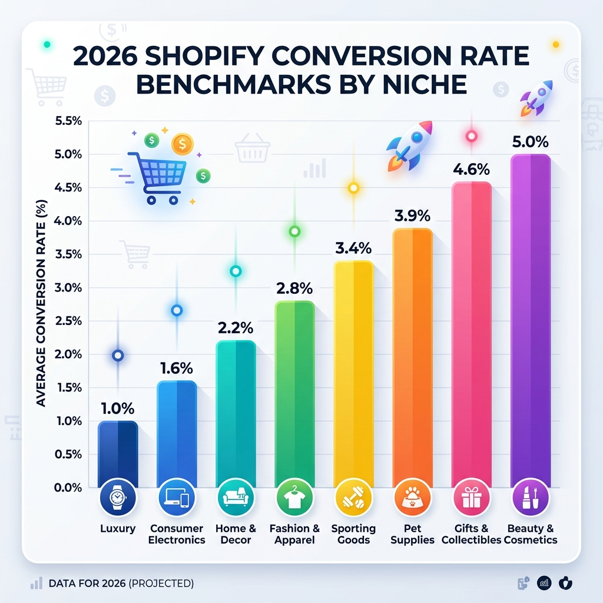
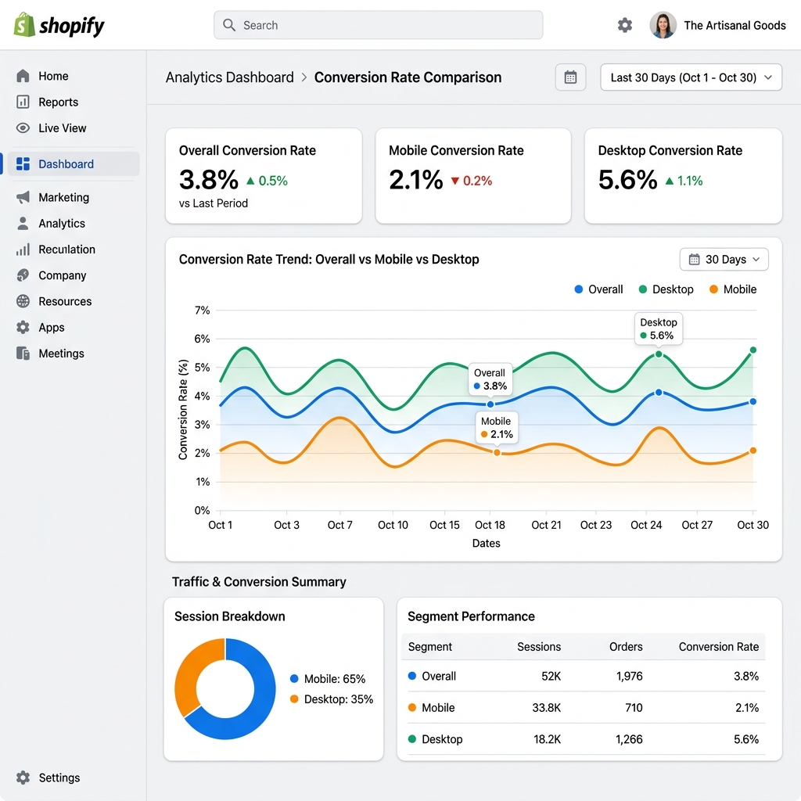
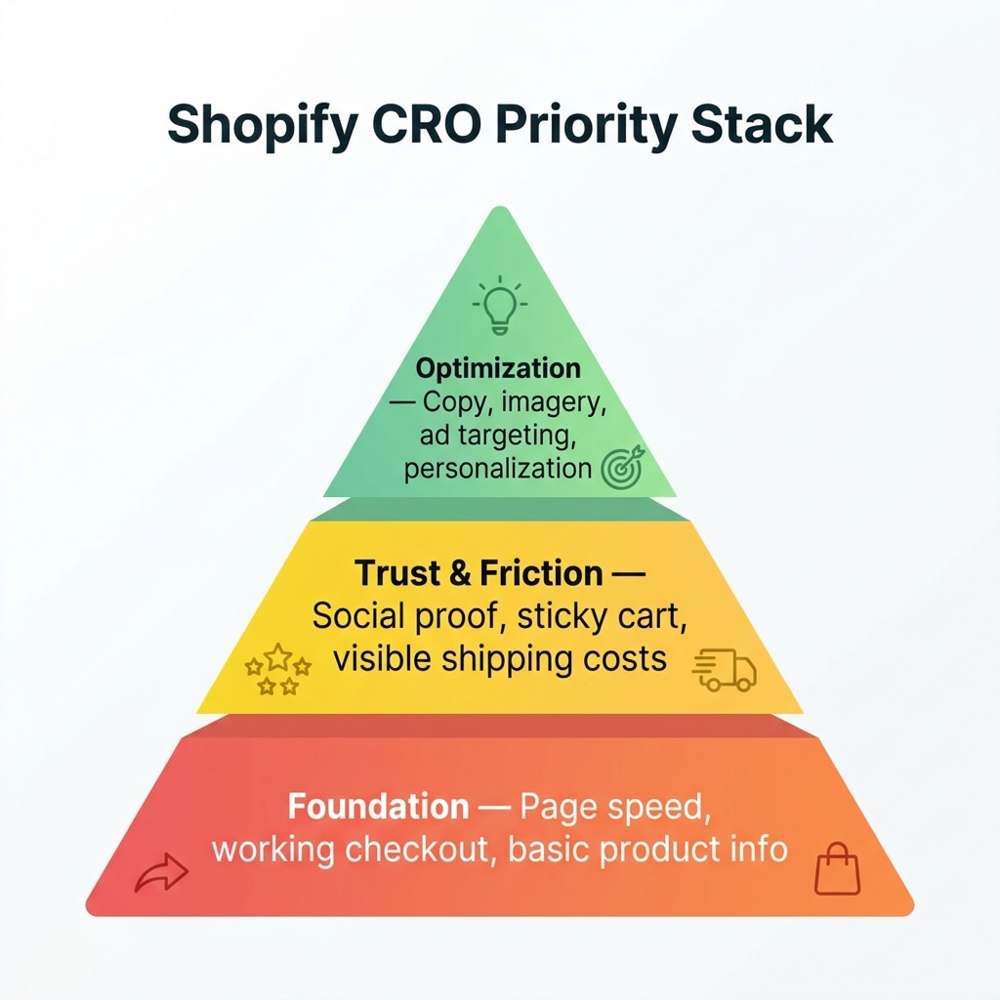

Wenn Sie je gegoogelt haben, was eine gute Shopify-Conversion-Rate ist, hat man Ihnen vermutlich rund 2–3 % genannt.

Diese Zahl ist weitgehend nutzlos.

Der Grund: Dieser Durchschnitt umfasst brandneue Shops, die noch nie etwas verkauft haben, Shops mit defektem Checkout, Shops mit unpassendem Traffic aus schlechten Anzeigen und Shops, die als Experiment angelegt und nie wieder angefasst wurden.

Die Zahl, die Sie tatsächlich brauchen, ist: **Womit sollte ein gut geführter Shop in meiner konkreten Nische konvertieren?**

Genau darum geht es hier. Wir haben Benchmark-Daten für 2026 aus mehreren Studien zusammengetragen — Littledatas Auswertung von 2.800 Shopify-Shops, Shopifys eigene interne Benchmarks und die branchenweiten Daten von IRP Commerce — und nach Nische aufgeschlüsselt, damit Sie Vergleichbares vergleichen.

---

## Warum die Conversion-Rate je nach Nische so stark schwankt

Bevor wir zu den Zahlen kommen, lohnt es sich zu verstehen, *warum* Conversion-Raten zwischen Produktkategorien so unterschiedlich ausfallen.

**Preis und Kaufrisiko** sind die größten Faktoren. Wer 14 $ für ein Reinigungsgel ausgibt, riskiert wenig. Ist es schlecht, sind 14 $ weg. Solche Käufe erfolgen eher impulsiv und mit weniger Recherche. Wer 1.400 $ für ein Möbelstück ausgibt, muss darüber nachdenken, den Raum ausmessen, den Partner fragen, Alternativen vergleichen. Mehr Recherche = mehr Sitzungen = niedrigere Conversion-Rate.

**Die Kauffrequenz** spielt ebenfalls eine Rolle. Wer monatlich Proteinpulver bestellt, weiß, was er will, und ist schnell durch den Checkout. Wer zum ersten Mal ein Kameraobjektiv kauft, besucht fünf Shops, sieht sich drei YouTube-Tests an und kommt über mehrere Sitzungen zurück.

**Die Greifbarkeit des Produkts** zählt mit. Kleidung, Schmuck und Möbel sind online schwer zu kaufen, weil man sie nicht ausprobieren kann. Dieses Zögern schlägt sich in der Conversion-Rate nieder.

Behalten Sie das im Blick, wenn Sie die Benchmarks unten lesen — wenn Sie Möbel verkaufen, müssen Sie nicht die Werte der Beauty-Branche erreichen.

---

---

## Die Benchmarks 2026 nach Nische

Hier sollte Ihr Shop stehen — auf Basis aggregierter Daten aus mehreren Studien der Jahre 2025–2026.

### Geschenke & Spezialitäten: 4,5–5,0 %
Diese Kategorie konvertiert durchgängig am höchsten, weil die Kaufentscheidung meist einfach ist (es ist ein Geschenk, jemand anderes nutzt es) und die Artikel risikoarm sind. Die emotionale Motivation ist hoch — man *will* etwas Schönes verschenken. Wenn Sie in diesem Bereich unter 3 % liegen, ist in Ihrem Trichter etwas kaputt.

### Beauty & Körperpflege: 4,5–4,9 %
Beauty ist eine Kategorie mit Wiederkäufen und hoher Markentreue. Hat jemand eine Feuchtigkeitscreme oder ein Serum gefunden, das ihm zusagt, kommt er alle 6–8 Wochen zurück. Social Proof (Bewertungen, Fotos, Erwähnungen durch Influencer) wirkt hier außerordentlich stark — Menschen vertrauen den Hautergebnissen anderer mehr als Produktbeschreibungen.

### Lebensmittel & Getränke: 3,0–4,5 %
Große Spanne, weil sowohl Impulskäufe (handwerkliche Snacks, Craft-Hot-Sauce) als auch überlegte Anschaffungen (Spezialausstattung für Kaffee) dazugehören. Die reibungsarmen Verbrauchsprodukte konvertieren sehr hoch. Liegen Sie hier unter 2 %, schwächeln vermutlich Ihre Produktbeschreibungen und Fotos.

### Gesundheit & Wellness: 3,0–3,5 %
Nahrungsergänzung, Fitnessausrüstung und Wellnessprodukte profitieren von starkem Social Proof und nutzenorientierten Texten. Das Zögern „Wirkt das überhaupt?“ ist real — Shops, die es mit Erfahrungsberichten und Bewertungen adressieren, schneiden besser ab als solche, die mit Inhaltsstoffen und Datenblättern beginnen.

### Mode & Bekleidung: 2,5–3,1 %
Unsicherheit bei Größen, Passformbedenken und hohe Retourenquoten erzeugen Reibung. Shops am oberen Ende dieser Spanne bieten in der Regel ausführliche Größentabellen, mehrere Produktfotos (auch am Modell) sowie klare, unkomplizierte Rückgaberegeln prominent auf der Produktseite.

### Haus & Garten: 2,1–2,8 %
Bei Wohnprodukten dauert die Überlegungsphase oft länger — Menschen messen Räume aus, prüfen Kompatibilität, sprechen sich ab. Gute Produktfotografie mit Größenbezug, „im Raum“ inszenierte Lifestyle-Aufnahmen und starke Bewertungen bewirken hier mehr als Dringlichkeitstaktiken.

### Elektronik & Technik: 1,4–2,3 %
Lange Recherchephasen, hohe Preise und starke Konkurrenz durch Amazon und große Handelsketten drücken die Conversion-Rate. Korrekte technische Daten, Kompatibilitätsangaben und Vertrauenssignale (Garantie, Rückgaberegeln) zählen hier mehr als in jeder anderen Kategorie.

### Schmuck: 1,2–2,0 %
Schmuck ist persönlich, oft teuer und allein anhand von Fotos schwer zu beurteilen. Shops, die Videos getragener Stücke, ausführliche Materialangaben und unkomplizierte Rückgabe- und Umtauschregeln bieten, konvertieren durchgängig besser als solche, die sich auf Standbilder verlassen.

### Luxus & Premium (1,0–1,5 %)
Niedrige Conversion ist hier Teil des Modells — die Customer Journey für eine Handtasche für 1.500 $ oder eine Uhr für 3.000 $ umfasst viele Kontaktpunkte. Vergleichen Sie sich nicht mit Massenmarkt-Shops. Eine Conversion-Rate von 1,2 % bei einem Bestellwert von 900 $ ist ein profitableres Geschäft als 4 % bei 22 $.

---

## So berechnen Sie Ihre eigene Conversion-Rate

Bevor Sie sich vergleichen, stellen Sie sicher, dass Sie das Richtige messen.

Shopify berechnet die Conversion-Rate standardmäßig so:

**Conversion-Rate = Bestellungen gesamt ÷ Sitzungen gesamt × 100**

Sie finden das unter: *Shopify-Admin → Analysen → Berichte → Verhalten → Conversion-Rate des Onlineshops.*

Einige Dinge, die Sie prüfen sollten:

**Betrachten Sie nicht nur Mischwerte.** Ihre Gesamt-Conversion-Rate verdeckt, was wirklich passiert. Schlüsseln Sie auf nach:
- Mobil vs. Desktop (üblicherweise 1–2 Prozentpunkte Unterschied)
- Traffic-Quelle (organische Suche konvertiert deutlich besser als bezahlte Social-Media-Anzeigen)
- Neue vs. wiederkehrende Besucher (wiederkehrende sollten 2- bis 3-mal so hoch konvertieren)

Liegt Ihr mobiler Wert weit unter dem Desktop-Wert, hat Ihr mobiles Erlebnis Reibungsprobleme. Konvertiert Ihr bezahlter Traffic weit unter dem organischen, bringen Ihre Anzeigen das falsche Publikum.

---

---

## Die häufigsten Gründe, warum Shops unter ihrem Benchmark bleiben

Sobald Sie wissen, wo Sie im Vergleich zu Ihrer Nische stehen, lautet die nächste Frage: Warum schneiden Sie schwächer ab?

Hier die fünf häufigsten Ursachen, grob nach Häufigkeit geordnet:

### 1. Langsame Ladezeiten (besonders mobil)
Das ist der stille Conversion-Killer. Die Daten von Google sind eindeutig: Steigt die mobile Ladezeit von 1 auf 3 Sekunden, erhöht sich die Absprungrate um 32 %. Bei 5 Sekunden sind es 90 %. Jede App, die Sie in Ihrem Shopify-Shop installieren, fügt Ihrer Seite JavaScript hinzu. Gehen Sie Ihre Apps durch — entfernen Sie alles, was Sie nicht aktiv nutzen, und stellen Sie sicher, dass die verbleibenden Apps asynchron laden, statt das Rendering zu blockieren.

### 2. Kein Social Proof auf Produktseiten
Wenn Ihre Produktseiten keine Bewertungen und keine sichtbare Kaufaktivität zeigen, bitten Sie Fremde darum, Ihnen ihr Geld anzuvertrauen — ohne jeden Beleg. Das ist der größte Treiber der „Checkout-Angst“, jenes nagenden Gefühls, dass dieser Shop vielleicht nicht seriös ist oder das Produkt nicht gut genug, um Bewertungen zu bekommen. Schon 5–10 echte Bewertungen pro Produkt machen einen spürbaren Unterschied.

### 3. Überraschende Versandkosten an der Kasse
Eine Versandgebühr von 7,99 $, die erstmals im Checkout auftaucht, gehört weltweit zu den Hauptgründen für Warenkorbabbrüche. Die Lösung ist einfach: Zeigen Sie Versandkosten früh (auf der Produktseite oder in einem dauerhaften Banner), oder richten Sie einen Schwellenwert für kostenlosen Versand ein, der Kunden zu einem Mindestbestellwert motiviert.

### 4. Die Kaufen-Schaltfläche verschwindet auf dem Smartphone
In den meisten Shopify-Themes sitzt die In-den-Warenkorb-Schaltfläche oben auf der Produktseite. Scrollt ein mobiler Nutzer nach unten, um Bewertungen zu lesen, ist die Schaltfläche weg. Eine fixierte Leiste, die beim Scrollen sichtbar bleibt, schließt diese Lücke deutlich — typischerweise allein 10–15 % mehr mobile Conversions.

### 5. Schlechte Traffic-Qualität
Manchmal liegt das Problem nicht am Shop, sondern daran, wen Sie dorthin schicken. Wenn Sie Anzeigen an eine breite Zielgruppe ausspielen oder für Suchbegriffe ranken, die nicht zu Ihrem Produkt passen, bekommen Sie Besucher, die ohnehin nie gekauft hätten. Eine Conversion-Rate von 0,3 % bei bezahltem Social-Traffic ist normal. Eine Conversion-Rate von 0,3 % bei organischem Suchtraffic deutet darauf hin, dass mit Ihren Produktseiten oder Vertrauenssignalen etwas ernsthaft nicht stimmt.

---

## Ein einfacher Prioritätenplan

Je nachdem, wo Ihre Conversion-Rate im Vergleich zum Nischen-Benchmark liegt, packen Sie zuerst Folgendes an:

**Wenn Sie 50 % oder mehr unter Ihrem Benchmark liegen:**
Beginnen Sie mit den Grundlagen. Prüfen Sie die Seitengeschwindigkeit, stellen Sie sicher, dass der Checkout mobil funktioniert, und sammeln Sie mindestens 5–10 Bewertungen für Ihre 5 wichtigsten Produkte. Das sind Grundvoraussetzungen.

**Wenn Sie 20–50 % unter Ihrem Benchmark liegen:**
Konzentrieren Sie sich auf Vertrauenssignale und weniger Reibung. Ergänzen Sie Social Proof (Verkaufsbenachrichtigungen, Bewertungszahlen), verbessern Sie Ihr mobiles Erlebnis (Sticky Cart) und machen Sie Versandkosten vor dem Checkout sichtbar.

**Wenn Sie auf oder nahe Ihrem Benchmark liegen:**
Sie machen die Grundlagen richtig. Um in die oberen 20 % Ihrer Nische vorzustoßen, sehen Sie sich die Texte Ihrer Produktseiten an, die Qualität Ihrer Bilder und das Erlebnis nach dem Anzeigenklick. Kleine Verbesserungen summieren sich.

---

---

## Werkzeuge, die genau diese Zahlen bewegen

**Für Social Proof und Vertrauen:** [FomoGen](/de/apps/fomogen) — ergänzt Verkaufsbenachrichtigungen, Bestandswarnungen und Trust-Badges. Kostenloser Tarif verfügbar.

**Gegen mobile Reibung:** Die fixierte In-den-Warenkorb-Leiste von FomoGen hält die Kaufen-Schaltfläche bei jedem Scrollen sichtbar. Den vollständigen Leitfaden finden Sie in unserem Beitrag zum [mobilen Sticky Cart](/de/blog/mobile-sticky-cart-guide).

**Für kostenlosen Versand:** Die Versandleiste von FomoGen zeigt Kunden genau, wie nah sie am kostenlosen Versand sind, und steigert so Bestellwert und Conversion-Rate zugleich.

**Für die Seitengeschwindigkeit:** Die PageSpeed-Insights-Integration von Shopify in Ihrem Theme-Editor — beginnen Sie damit, ungenutzte Apps zu entfernen, und prüfen Sie dann Ihre Bildgrößen.

Der größte Fehler von Händlern ist der Versuch, alles auf einmal zu beheben. Nehmen Sie den einen Hebel, der für Ihre Nische am weitesten unter dem Benchmark liegt, und arbeiten Sie 30 Tage lang nur daran, bevor Sie zum nächsten übergehen.

> **Vergleichen Sie Ihren Shop und beheben Sie dann das Richtige.** [FomoGen](/de/apps/fomogen) übernimmt die Ebenen Social Proof und Reibung — kostenlos im Einstieg, eine Installation, keine Geschwindigkeitseinbußen.
>
> **[FomoGen kostenlos bei Shopify installieren →](https://apps.shopify.com/fomogen)**

---
