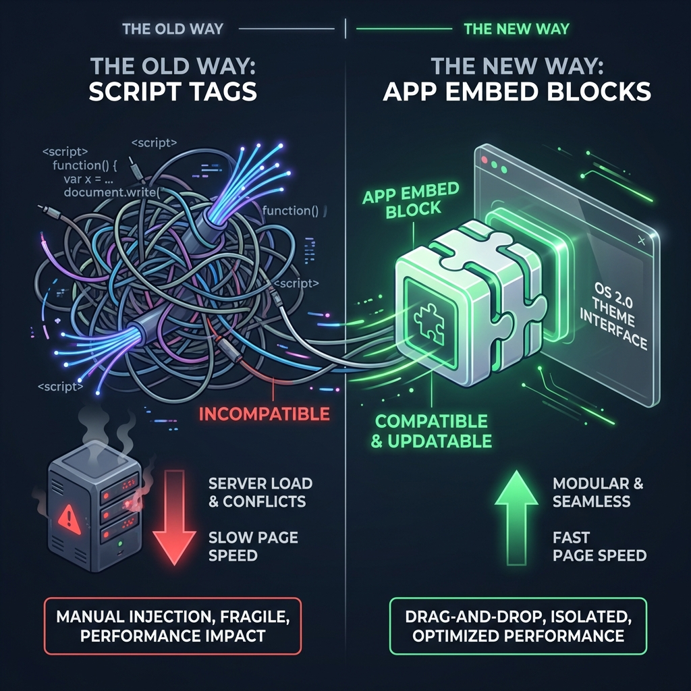

Sie haben Tausende für Werbung ausgegeben, um Besucher zu gewinnen. Trotzdem ist Ihre Absprungrate hoch. Warum? Womöglich liegt es an Ihrer Ladezeit. Die Daten von Google sind unerbittlich: Steigt die Ladezeit von 1 auf 3 Sekunden, erhöht sich die Absprungwahrscheinlichkeit um 32 %. Und für jede einzelne Sekunde, die Sie einsparen, kann die Conversion-Rate um 17 % steigen.

## Der Übeltäter: JavaScript-Ballast

Viele Shopify-Apps — insbesondere ältere Social-Proof-Apps — schleusen umfangreichen JavaScript-Code in Ihr Theme. Dieser blockiert häufig das Rendering, das heißt der Kunde sieht einen weißen Bildschirm, bis das Skript fertig geladen hat.

## Script-Tags vs. App-Embed-Blöcke (der Standard 2026)

Alte Apps arbeiten mit **Script-Tags**. Sie zwingen Code in Ihren `<head>` und verlangsamen die gesamte Seite. Moderne Apps (wie FOMO Gen) nutzen **Shopify App-Embed-Blöcke**.

**Warum App Embeds schneller sind:**

- **Modular:** Der Code wird nur geladen, wenn der Block aktiv ist.
- **Asynchrones Laden:** Sie hindern den Rest Ihrer Seite nicht daran, gerendert zu werden.
- **Saubere Deinstallation:** Entfernen Sie die App, verschwindet der Code. Alte Apps hinterlassen oft „Zombie-Code“, der Sie dauerhaft ausbremst.

## So prüfen Sie Ihren Shop

1. **PageSpeed Insights prüfen:** Achten Sie auf Ihre „Time to Interactive“ (TTI).
2. **Apps durchgehen:** Haben Sie eine App für den Sticky Cart, eine weitere für Badges und noch eine für Pop-ups? Das sind 3 separate HTTP-Anfragen.
3. **Zusammenführen:** Der Wechsel zu einer All-in-One-Lösung wie FOMO Gen ersetzt mehrere schwere Skripte durch eine einzige, optimierte Ressource.

## Teil der Performance-Themenseite

Die Seitengeschwindigkeit ist nur eine Variable. Entdecken Sie die vollständige [Themenseite zur E-Commerce-Performance](/de/ecommerce-performance-2026-benchmarks) für einen mathematischen Zugang zu mehr Umsatz.

## Das Fazit

Google wertet die Core Web Vitals als Rankingfaktor. Sie können es sich nicht leisten, Geschwindigkeit für Funktionen zu opfern. Sie brauchen eine App, die beides bietet.
