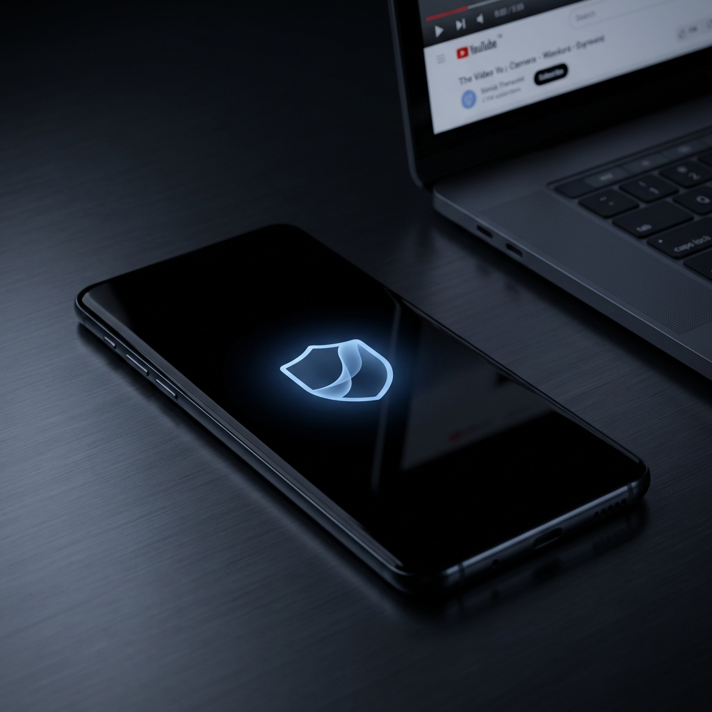

Wir kennen das alle: Sie hören einen zweistündigen Podcast oder einen Lo-fi-Mix zum Lernen auf YouTube, aber Ihr Display leuchtet in der Hosentasche wie eine kleine Sonne. Das ist nicht nur ein sicheres Rezept für „Geisterberührungen“, die Ihre Lieblingstitel überspringen — es ist auch der schnellste Weg, den Akku zu leeren.

Premium-Abos bieten zwar Hintergrundwiedergabe, doch es gibt eine effizientere Lösung auf Hardware-Ebene, die weder eine monatliche Gebühr noch aufdringliche Berechtigungen verlangt. Auftritt ScreenVeil: das schlanke Werkzeug, das Ihren Bildschirm in eine akkusparende schwarze Fläche verwandelt, während der Ton einfach weiterläuft.

## Die Physik des Sparens: Warum „echtes Schwarz“ zählt

Wenn Sie ein modernes Smartphone besitzen (etwa ein Samsung Galaxy, Google Pixel oder ein hochwertiges OnePlus), haben Sie sehr wahrscheinlich ein AMOLED- oder OLED-Display. Anders als klassische LCDs mit dauerhafter Hintergrundbeleuchtung sind OLED-Pixel selbstleuchtend — sie erzeugen ihr Licht selbst.

Zeigt ein OLED-Pixel „echtes Schwarz“, **schaltet es sich physisch ab**. Es verbraucht **keinerlei Strom**.

> **Experten-Einblick:** Laut Daten, die auf dem Android Dev Summit vorgestellt wurden, können dunkle Modi oder schwarze Overlays den Stromverbrauch des Displays auf AMOLED-Bildschirmen bei maximaler Helligkeit um bis zu 63 % senken.

Wenn Sie beim Streamen mit einer App wie ScreenVeil eine reine schwarze Ebene darüberlegen, „dimmen“ Sie nicht bloß das Licht — Sie versetzen Ihre Hardware praktisch in einen hocheffizienten Ruhezustand.

## Warum ScreenVeil 2026 das Mittel der Wahl ist

In einem Markt voller „Task Killer“ und werbeverseuchter „Akku-Booster“ sticht [ScreenVeil](/de/apps/screenveil) (com.screenveil.app) durch radikale Einfachheit und eine datenschutzorientierte Architektur hervor.

### 1. Universelle Kompatibilität

Anders als browserbasierte Umgehungen, die Google regelmäßig abklemmt, funktioniert ScreenVeil über **jeder App**. Ob YouTube, Netflix, Prime Video oder Spotify — wenn es Video abspielt, kann ScreenVeil es „verhüllen“.

### 2. Datenschutz ohne Berechtigungen

Die meisten Utility-Apps sind datenhungrig. ScreenVeil ist bekanntermaßen „offline“. Die App benötigt keine Internetberechtigung und keinen Zugriff auf persönliche Daten. Sie braucht lediglich die Berechtigung „Über anderen Apps anzeigen“, um das schwarze Overlay zu erzeugen.

### 3. Intelligenter Schutz für die Hosentasche

Einer der größten Ärgernisse beim Hören unterwegs ist die „Geisterberührung“. Das intelligente Entsperrsystem von ScreenVeil verlangt eine bestimmte Tippfolge, um den Bildschirm freizugeben — so ruft Ihr Telefon nicht versehentlich Ihren Chef an, während Sie eine Einschlafgeschichte hören.

## Einrichtung in 30 Sekunden

1. **Herunterladen:** Holen Sie sich [ScreenVeil: Screen Off Video](https://play.google.com/store/apps/details?id=com.screenveil.app) aus dem Google Play Store.

2. **Overlay aktivieren:** Erteilen Sie einmalig die Berechtigung „Über anderen Apps anzeigen“.

3. **Dienst starten:** Tippen Sie in der App auf „Dienst starten“.

4. **Verhüllen:** Öffnen Sie Ihre Video-App, starten Sie die Wiedergabe und tippen Sie auf das schwebende ScreenVeil-Symbol. Ihr Bildschirm wird pechschwarz, der Ton läuft ununterbrochen weiter.

## Das Fazit: Lohnt sich das?

Wenn Sie Ihr Telefon häufig für „Nur-Ton“-Videokonsum nutzen, sprechen die Zahlen für sich. Der Wechsel von einem leuchtenden Bildschirm zu einem schwarzen Overlay kann Ihre **Hörzeit auf kompatiblen Geräten um über 50–80 % verlängern**.

In einer Zeit, in der die Akkugesundheit über die Lebensdauer des Geräts entscheidet, ist „digitale Sauberkeit“ und der Einsatz hardwarebewusster Werkzeuge wie ScreenVeil kein bloßer Trick — für Power-User ist es eine Notwendigkeit.

## Bringen Sie auch Ihren Shopify-Shop voran

Wenn Sie zusätzlich einen Shopify-Shop betreiben, werfen Sie einen Blick in unseren [Leitfaden zum mobilen Sticky Cart](/de/blog/mobile-sticky-cart-guide) — der eine UX-Kniff, der die Conversions um 15 % gesteigert hat.

---

**Bereit, Akku zu sparen? Schließen Sie sich 10.000+ Android-Nutzern an.**

[⬇️ ScreenVeil kostenlos installieren](https://play.google.com/store/apps/details?id=com.screenveil.app) | [Mehr erfahren](/de/apps/screenveil) | [Die Physik dahinter](/de/docs/screenveil/amoled-efficiency)
