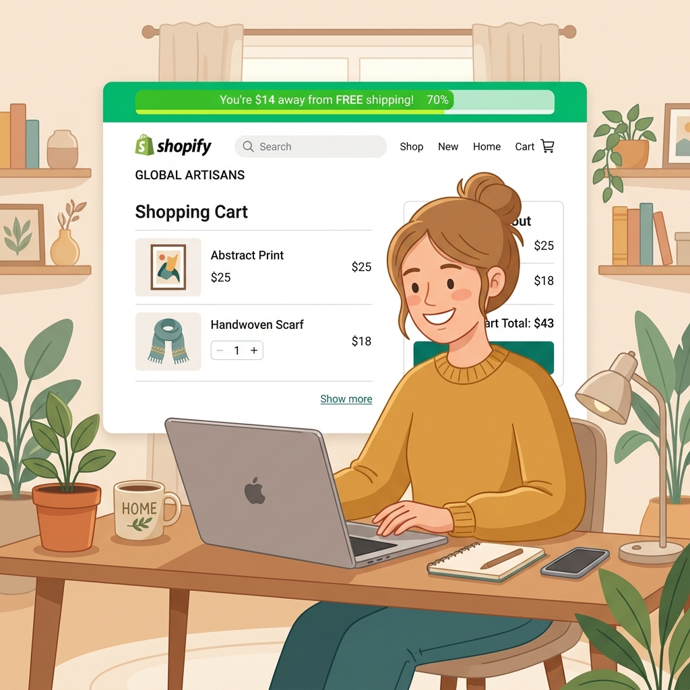
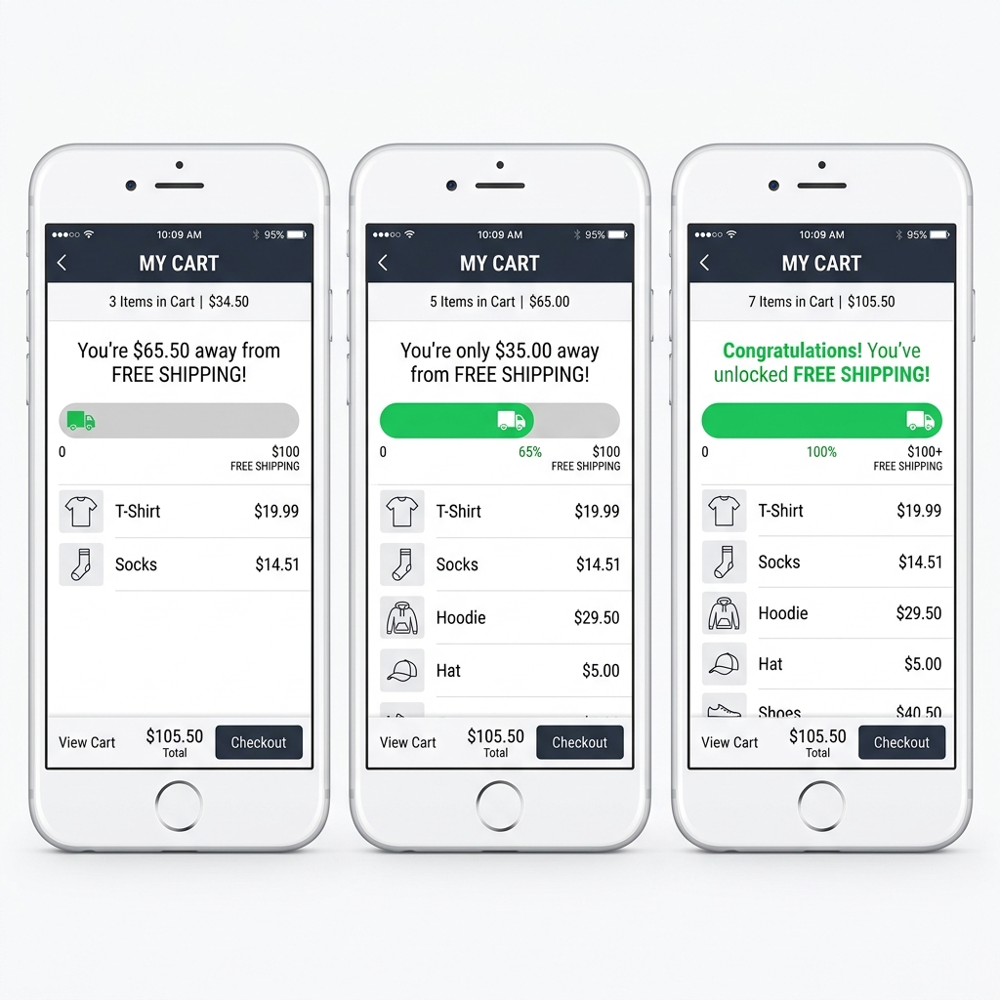
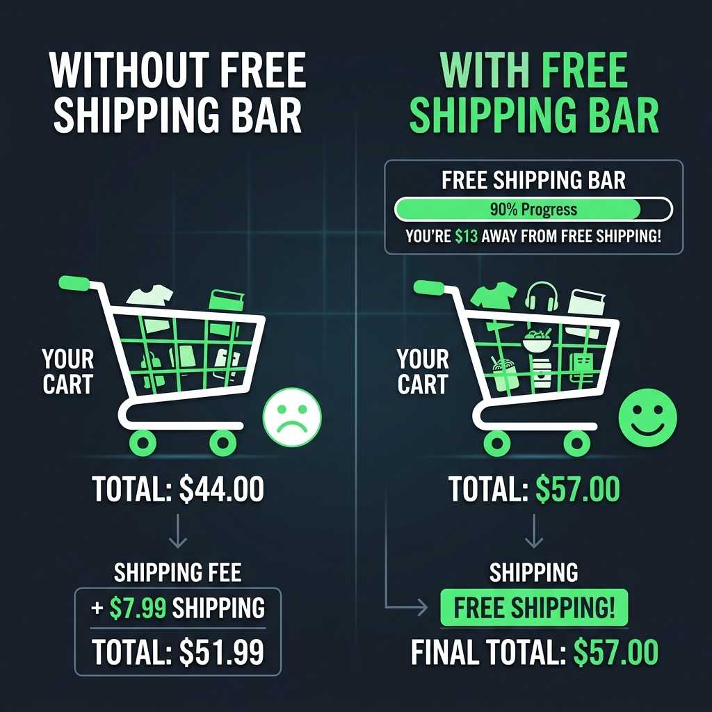

Here's something that happens in almost every online store, every single day.

A customer has $38 in their cart. Your free shipping threshold is $50. They get to the checkout page, see a $6.99 shipping charge, and think: *"Hmm. Maybe later."*

And they leave.

Not because they didn't want the product. Not because the price was wrong. Just because that shipping fee showed up at the worst possible moment — after they'd already committed to buying — and it felt like a trap.

A **free shipping progress bar** solves this before it becomes a problem. Instead of hiding the shipping cost until checkout, you put the free shipping offer front and center: *"Spend $12 more and get free shipping."*

It's one of the easiest wins in e-commerce. Let's set it up.

---

## Why Free Shipping Bars Work So Well

It comes down to two things: everyone hates surprise costs, and everyone loves finishing something they've started.

**The surprise cost problem** is well-documented. Unexpected charges at checkout are the number one reason people abandon their cart. When a customer sees your products for $38 and then gets hit with a $6.99 shipping fee at checkout, that 18% price increase feels unfair — even if the total is still a great deal. They feel tricked, even when they weren't.

A free shipping bar deals with this by making the offer visible from the start. The customer knows the rules when they're still in a good mood and adding items to their cart.

**The "finishing what you started" effect** is even more powerful. Psychologists call it the *endowed progress effect* — we're much more motivated to reach a goal when we can see we're already making progress toward it. A progress bar that's 60% full feels like something you've invested in. You want to see it hit 100%.

That's why the bar works better than just writing "Free shipping on orders over $50" in your header. The visual progress makes it feel achievable and personal.

---

---

## Step-by-Step: Adding a Free Shipping Bar with FomoGen

### Step 1: Install FomoGen

If you haven't already, install [FomoGen from the Shopify App Store](https://apps.shopify.com/fomogen). It's free to start and takes about 60 seconds to install.

### Step 2: Open the Free Shipping Bar Feature

From your FomoGen dashboard, click **Free Shipping Bar** in the left navigation. Then click **Create New Bar**.

### Step 3: Set Your Threshold

This is the most important step. Enter the minimum cart value required for free shipping — this should match whatever threshold you're offering in your store.

If you haven't decided on a threshold yet, skip to the section below where I walk you through how to calculate the right number for your store.

### Step 4: Write Your Messages

FomoGen lets you set three different messages that show at different stages of the journey:

**Starting message** (cart is empty or low):
Something like: *"Spend $50 for FREE shipping! 🚚"*

**Progress message** (cart is partway there):
This is the most important one. Include the exact amount left:
*"You're just $[amount] away from free shipping!"*
FomoGen fills in the [amount] dynamically based on what's in the cart.

**Congratulations message** (threshold reached):
*"You've unlocked FREE shipping! 🎉"*

Keep the language warm and casual — this is a reward, not a legal notice.

### Step 5: Choose Where It Shows

Tick all three placements:
- **Announcement bar** (top of every page)
- **Cart drawer** (when someone opens the side cart)
- **Cart page** (before checkout)

The more places it shows, the more likely it is to catch a customer at the right moment.

### Step 6: Style It to Match Your Store

Pick your brand colors for the bar fill and background. Keep it simple — the bar itself is the hero, not the design around it.

### Step 7: Save and Go Live

Hit **Save** and toggle the bar to **Active**. Open your store in a new tab and add something to your cart — you should see the bar in action immediately.

---

---

## How to Calculate the Right Free Shipping Threshold

This is where most merchants go wrong. They either set the threshold too low (they give away free shipping on orders that don't cover the cost) or too high (the goal feels impossible so people ignore it).

Here's the formula that works:

**Step 1:** Find your current average order value (AOV). You can find this in Shopify Analytics under *Reports → Sales.*

**Step 2:** Multiply your AOV by 1.3. That's your starting threshold.

So if your current AOV is $42, set your free shipping threshold at **$55**.

Why 1.3x? Because most customers will be close enough to the threshold that adding one small item gets them there. If the threshold is too far above their cart value, they stop trying. If it's right below their natural spend, they don't bother adding anything either.

**Step 3:** Check your margins. Make sure the extra revenue from that top-up order covers your average shipping cost. If shipping costs you $7 and your margin is 50%, you need $14 in extra product revenue to break even on the shipping. At a 1.3x threshold, most stores come out ahead.

Run this for 30 days, then check if your AOV has moved. If it has, recalculate and adjust your threshold upward.

---

## A Real Example of the Math

Let's say you sell skincare. Your average order is $44 and shipping costs you $6.50.

You set your free shipping threshold at $57 (roughly 1.3x).

Before the bar: most customers check out at $44, paying $6.50 shipping. You keep $44 in product revenue.

After the bar: customers see they need $13 more for free shipping. Many add a travel-size item or a lip balm. Their cart is now $57. You give free shipping (cost: $6.50) but gain $13 in extra product revenue. Net gain: $6.50 per upgraded order.

At 100 orders a month, if even 30% of customers top up their cart, that's $195/month in extra revenue from a free bar on your store. Numbers compound fast.

---

## Common Mistakes to Avoid

**Setting the bar too high.** If your AOV is $35 and your threshold is $100, the bar will just make customers feel like they can never win. They'll ignore it or get annoyed. Keep it reachable.

**Only showing it on the cart page.** Most customers never reach the cart page. They browse, make up their mind on the product page, and either bounce or go straight to checkout. Put the bar on every page.

**Forgetting to update it after a sale.** If you run a 20% sale and products cost less, customers will need to add more items to hit the same threshold. Either drop your threshold temporarily during sales or mention it clearly.

**Using confusing language.** "Earn free delivery when qualifying subtotal exceeds threshold" is a terrible bar message. Write like a human: "You're $8 away from free shipping!" — that's it.

---

---

## Stack It With Social Proof for Even Better Results

The free shipping bar tells customers *what to do* (add more to cart). Social proof tells them *why it's safe* (other people are buying). Together they create a store environment where buying feels like the obvious, natural thing to do.

Once your free shipping bar is live, go back into FomoGen and turn on your **Sales Notification** popup. The combination of "others are buying" and "you're close to free shipping" is one of the most effective conversion combinations you can put on a Shopify store.

> **Want to set this up today?** [FomoGen](/apps/fomogen) includes a free shipping progress bar, sales notifications, sticky cart, and stock countdowns — all free to start, all in a single 2.1KB install.
>
> **[Install FomoGen Free on Shopify →](https://apps.shopify.com/fomogen)**

---

**Related:** Learn how to pair your free shipping bar with [low stock alerts](/blog/add-low-stock-alerts-shopify/) that create urgency on your best-selling products — the two tools work together to push browsing customers into buying mode.
