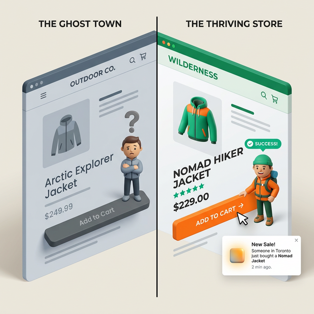
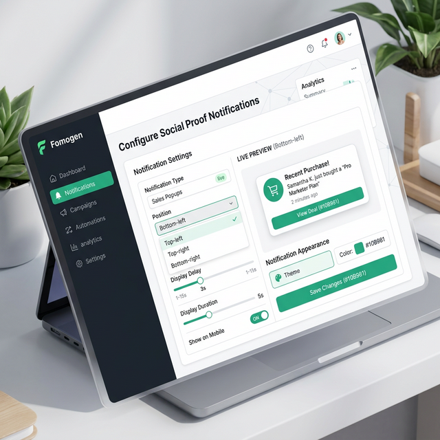
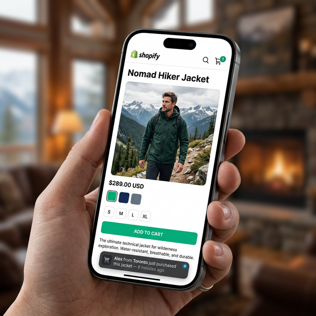

You've got traffic coming to your store. People are clicking around, checking out your products. But then... they leave without buying.

Sound familiar?

One of the biggest reasons visitors don't buy is simple: they're not sure other people are buying either. Your store might have great products, but if there's no sign of life — no reviews, no activity, no proof that real humans are purchasing — your visitor's brain quietly files it under "risky."

A sales notification popup fixes that. It's the small widget that pops up in the corner of your store saying things like *"Sarah from New York just bought the Classic Leather Bag — 4 minutes ago."*

It works because it's real. And in this guide, I'll show you exactly how to add one to your Shopify store, free, in about 5 minutes.

---

## Why Your Visitors Need to See Other People Buying

Think about the last time you walked past a restaurant. Which one did you feel more like going into — the one that was buzzing and full, or the one that was completely empty?

Your Shopify store works the same way.

When someone lands on your store for the first time, they're a stranger. They don't know you. They're asking themselves: *Is this real? Will it actually ship? Is anyone else buying this?*

A sales notification popup answers all three questions in one small moment. It says: yes, this store is active, real people just bought something, and they did it recently.

Psychologists call this **social proof** — we look to what others are doing to decide what's safe. It's why Amazon shows "1,200 people bought this last month" on product pages. It's why restaurants put "Most Popular" stickers on menu items.

You don't need Amazon's budget to do this. You just need the right Shopify app.

---

---

## What a Good Sales Notification Popup Shows

Not all popups are equal. A good one includes:

- **First name + city** of the buyer (e.g. "Emma from Chicago")
- **Product name** and optionally a small product thumbnail
- **Time since purchase** (e.g. "12 minutes ago")
- **A subtle design** that doesn't cover your main content

A bad one shows fake names, fake locations, or a timer that resets every time you refresh the page. Visitors notice this in 2026 — and once they do, they're gone.

---

## Step-by-Step: Adding a Sales Popup to Shopify with FomoGen

Here's how to set it up from scratch. This takes about 5 minutes.

### Step 1: Install FomoGen

Go to the [Shopify App Store](https://apps.shopify.com/fomogen) and search for **FomoGen**. Click "Add app" and follow the install flow. It's free to install with a generous free plan.

### Step 2: Open the FomoGen Dashboard

Once installed, click "Open app" from your Shopify admin. You'll land on the FomoGen dashboard. On the left sidebar, click **Social Proof Notifications**.

### Step 3: Create Your First Campaign

Click **New Campaign** and give it a name (something like "Recent Purchases Popup"). Select **Sales Notification** as the campaign type.

FomoGen will automatically pull in your real Shopify order data — no manual setup needed. Every time someone places an order in your store, their purchase can show up in the popup.

### Step 4: Customize How It Looks

You can change:

- **Position** — bottom-left is recommended
- **Colors** — match your brand
- **Display delay** — how many seconds after page load before it appears (3–5 seconds is a good starting point)
- **Time between notifications** — how long between each popup showing (8–12 seconds works well)
- **What information to show** — name, city, product, time

Keep it clean. Don't jam too much text into the widget.

### Step 5: Set Your Order Window

Under **Data Settings**, choose how far back you want to pull orders. If your store gets regular daily orders, set it to **Last 24 hours**. If you're a newer store with less volume, **Last 7 days** is fine.

This is important. Showing a purchase from 6 months ago with "183 days ago" underneath it won't help you. Keep it recent and believable.

### Step 6: Save and Enable

Hit **Save**, then toggle the campaign to **Active**. That's it. Go to your storefront and wait 3–5 seconds — you should see your popup appear.

---

## Getting the Timing Right

The single biggest mistake people make with sales popups is showing them too aggressively. A popup that fires the second someone lands on your homepage feels spammy. It's like a salesperson jumping on you the moment you walk into a store.

Here's a timing setup that feels natural:

- **First popup delay:** 4 seconds after page load
- **Time between popups:** 10 seconds
- **Max popups per session:** 3–4

This way the visitor has had a chance to look around before being nudged, and they're not bombarded every few seconds.

---

## What to Do If You Don't Have Many Orders Yet

This is a real concern for new stores. If you only have 2–3 orders, a sales popup might do more harm than good if it shows the same two names over and over.

In that case, here are two options:

1. **Widen your order window to 30 days** — this gives you more data to rotate through
2. **Hold off on the sales popup and use a visitor counter instead** — showing "14 people are viewing this product right now" can create similar urgency without needing purchase history

FomoGen supports both. Once your order volume picks up, switch to the sales notification.

---

---

## The Speed Question: Will This Hurt My PageSpeed Score?

This is the #1 concern merchants have before installing any conversion app. Rightfully so — a lot of popup apps are bloated and slow down your store significantly.

FomoGen was built specifically to avoid this. It uses Shopify's **App Embed Block** system, which means:

- It doesn't inject scripts into your `<head>` tag
- It loads **after** your main page content, not before
- Its total payload is under 2.1KB

For context: a single low-resolution product image on your store is typically 50–200KB. FomoGen's entire script is smaller than 2.1KB. It will not show up on your PageSpeed Insights report as a problem.

---

## Pair It With Scarcity for Maximum Effect

A sales popup tells visitors that people are buying. A **low stock counter** tells visitors they need to buy *now*. Together they're a powerful combination.

Once you've set up your sales notification, head back to FomoGen and enable a **Stock Scarcity** widget for your top products. Something like *"Only 4 left in stock"* shown alongside recent purchase activity creates a genuine sense of urgency that lifts add-to-cart rates meaningfully.

> **Ready to add social proof to your store?** [FomoGen](/apps/fomogen) includes sales notification popups on the free plan — plus stock countdowns, sticky cart, and free shipping bars, all in a single lightweight install.
>
> **[Install FomoGen Free on Shopify →](https://apps.shopify.com/fomogen)**

---

**Next up:** Learn how to [calculate the perfect free shipping threshold](/blog/calculate-free-shipping-threshold/) for your store — and how to show it dynamically as a progress bar that increases your average order value.
