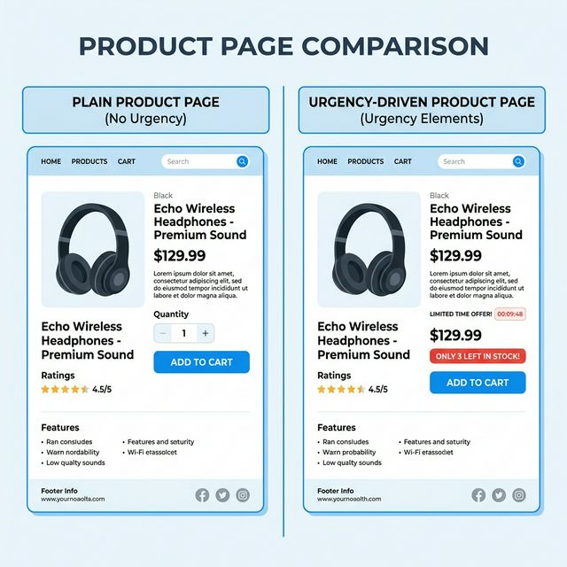
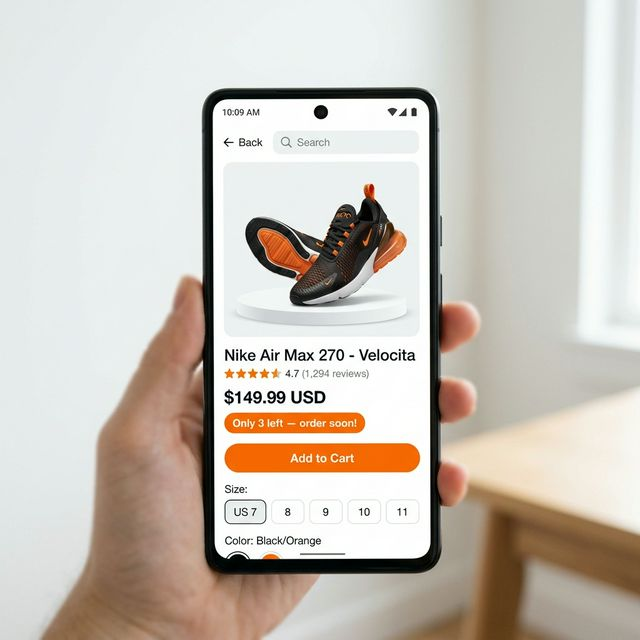
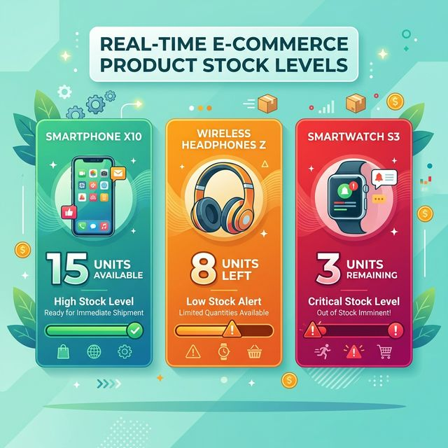

"Je reviendrai voir ça plus tard."

C'est ce que se dit votre visiteur quand il ferme votre page produit sans acheter. Et pour la plupart d'entre eux, "plus tard" n'arrive jamais. Ils sont distraits, oublient votre URL, ou trouvent un produit similaire ailleurs.

La vérité, c'est que la plupart des gens ne procrastinent pas parce qu'ils ne veulent pas le produit. Ils procrastinent parce qu'ils ne ressentent aucune raison d'agir *maintenant*. Il n'y a pas de délai. Aucun sentiment que attendre est risqué.

Une alerte de stock bas change ça.

Quand quelqu'un voit *"Plus que 4 en stock"* sur un produit qu'il envisageait déjà d'acheter, son cerveau fait quelque chose de prévisible : il passe de *"est-ce que je veux ça ?"* à *"que se passe-t-il si j'attends et que c'est épuisé ?"*

Ce n'est pas de la manipulation. C'est juste lui montrer une information précise qu'il n'avait pas avant. Et c'est l'une des choses les plus impactantes et les moins coûteuses que vous puissiez ajouter à votre boutique Shopify.

---

## La Psychologie Derrière "Plus que X en Stock"

Il existe un principe bien étudié en psychologie humaine appelé **l'aversion à la perte** — nous ressentons la douleur de perdre quelque chose environ deux fois plus fortement que nous ressentons le plaisir d'obtenir quelque chose d'équivalent.

Ce que ça signifie pour votre boutique : la peur de rater un produit qu'on aime déjà est un motivateur plus fort que le désir de l'obtenir. Un visiteur qui navigue sur votre boutique ressent un désir modéré. Le même visiteur qui voit "Plus que 2 en stock" ressent une légère peur. La peur convertit mieux.

La mise en garde importante : ça ne marche que quand c'est vrai. La fausse rareté est l'un des moyens les plus rapides de perdre définitivement la confiance d'un client. Si votre compteur affiche toujours "3 en stock" peu importe combien vous avez, les acheteurs avertis vont s'en rendre compte — et ils vont en parler à d'autres.

Quand c'est vrai, en revanche, c'est l'un des outils de conversion les plus efficaces à votre disposition.

---

---

## Comment Ajouter des Alertes de Stock Bas avec FomoGen

Voici la configuration complète, étape par étape.

### Étape 1 : Installer FomoGen

Si vous n'avez pas encore FomoGen, rendez-vous sur le [Shopify App Store](https://apps.shopify.com/fomogen) et installez-le — c'est gratuit. S'il est déjà installé, ouvrez l'application depuis votre admin Shopify.

### Étape 2 : Aller dans Rareté & Urgence

Dans le tableau de bord FomoGen, cliquez sur **Rareté & Urgence** dans la barre latérale gauche. Puis cliquez sur **Alerte de Stock Bas** → **Créer une Nouvelle Alerte**.

### Étape 3 : Définir Votre Seuil d'Inventaire

C'est le nombre en dessous duquel l'alerte apparaît.

- **Pour la plupart des boutiques :** 10 unités
- **Pour les produits qui se vendent vite :** 15 à 20 unités
- **Pour les produits premium ou à faible rotation :** 3 à 5 unités

Pensez-y du point de vue du client. "Plus que 10 en stock" semble urgent. "Plus que 47 en stock" ne l'est pas. Calibrez le seuil pour que l'alerte ne s'affiche que quand l'urgence est genuinement réelle.

### Étape 4 : Écrire Votre Message d'Alerte

FomoGen utilise un template simple où `{count}` est remplacé par le nombre réel d'inventaire :

**Message recommandé :**
*"⚡ Plus que {count} en stock — commandez vite !"*

Ou plus naturel :
*"Presque épuisé — plus que {count} disponibles."*

Faites court. Le chiffre fait la plupart du travail. N'écrivez pas un paragraphe.

### Étape 5 : Choisir Où Elle S'affiche

Sélectionnez **Page produit** comme emplacement principal. Vous pouvez aussi l'activer dans le **Panier coulissant** — c'est un emplacement malin parce qu'il touche les clients qui ont déjà ajouté l'article et qui hésitent encore à finaliser.

### Étape 6 : Choisir Quels Produits

Deux options :

- **Tous les produits :** L'alerte s'affiche sur chaque produit quand l'inventaire descend sous votre seuil. Bien si vous gérez un grand catalogue.
- **Produits spécifiques :** Vous choisissez manuellement quels produits reçoivent l'alerte. Bien pour vos meilleures ventes ou les produits que vous voulez vraiment écouler vite.

### Étape 7 : Styliser et Sauvegarder

Choisissez la couleur de votre alerte (l'orange ou le rouge fonctionne généralement mieux que le gris neutre — les couleurs chaudes signalent naturellement l'urgence), puis appuyez sur **Sauvegarder** et basculez sur **Actif**.

Ouvrez une de vos pages produit dans un nouvel onglet. Si ce produit a un inventaire sous votre seuil, vous verrez l'alerte immédiatement.

---

---

## Bien Calibrer le Seuil : Des Exemples Pratiques

Différents produits ont besoin de seuils différents. Voici un guide pratique :

**Produits à fort volume** (ex : coques de téléphone, bougies, vêtements basiques) :
Fixez le seuil à 15 à 20 unités. Ces produits bougent vite, et afficher "Plus que 18 en stock" sur un produit qui se vend à 50 unités par jour est genuinement utile pour un client.

**Produits à volume moyen** (ex : soins de la peau, accessoires, cadeaux) :
Fixez le seuil à 8 à 12 unités. C'est la configuration la plus courante. L'urgence est réelle et le chiffre est assez bas pour être significatif.

**Produits premium à faible volume** (ex : articles faits main, éditions limitées, bijoux) :
Fixez le seuil à 3 à 5 unités. Pour les articles que vous ne stockez genuinement qu'en petite quantité, même "Plus que 5 en stock" est un signal important. Ces produits bénéficient souvent le plus de l'alerte.

**Dropshipping :** Si vous faites du dropshipping et ne contrôlez pas directement l'inventaire, utilisez l'alerte avec précaution et uniquement pour des produits dont vous êtes sûr des niveaux de stock réels du fournisseur. Afficher "Plus que 2 en stock" quand le fournisseur en a 500 est le genre de chose qui génère des remboursements et des litiges.

---

## Ce Qu'il Ne Faut Pas Faire

**Ne pas fixer le seuil si haut qu'il s'affiche toujours.**
Si votre seuil de stock bas est à 50 unités et que vous avez rarement plus de 60, les clients verront toujours un avertissement de rareté. Après quelques visites, ça commence à sembler faux — même quand ça ne l'est pas. La crédibilité de l'alerte dépend du fait qu'elle soit l'exception, pas la règle.

**Ne pas utiliser un langage alarmant pour un stock moyen.**
"PLUS QUE 12 EN STOCK — PRESQUE ÉPUISÉ — AGISSEZ MAINTENANT !!!" pour un produit que vous réapprovisionnez chaque semaine est malhonnête dans l'esprit, même si le chiffre est exact. Gardez un ton calme et factuel.

**Ne pas l'afficher sur chaque produit à chaque visite.**
Si un client parcourt 10 produits et que chacun affiche une alerte de stock faible, il comprendra que c'est une tactique plutôt qu'un vrai signal. Soyez sélectif.

---

---

## Combinez Avec la Preuve Sociale Pour la Conversion Complète

Une alerte de stock bas répond à : *"Dois-je agir maintenant ?"* — oui, parce qu'il n'en reste plus beaucoup.

Une popup de notification de vente répond à : *"Est-ce que d'autres personnes achètent ça ?"* — oui, d'autres viennent juste d'en acheter.

Une barre panier sticky répond à : *"Comment j'achète ?"* — en appuyant sur le bouton qui est toujours là.

Quand vous avez les trois qui tournent ensemble, vous avez construit un environnement de conversion où chaque visiteur hésitant voit ses doutes adressés un par un. Ça ne semble pas agressif quand c'est bien fait — ça ressemble à une boutique bien tenue.

FomoGen a les trois en une seule installation. Le plan gratuit vous permet de lancer une campagne de chaque type, ce qui est suffisant pour démarrer et voir des résultats avant de décider si vous voulez passer à la version supérieure.

> **Configurez des alertes de stock bas aujourd'hui.** [FomoGen](/apps/fomogen) se synchronise avec votre vrai inventaire Shopify pour afficher des signaux de rareté genuins — pas de faux comptes à rebours, pas de chiffres inventés.
>
> **[Installer FomoGen Gratuitement sur Shopify →](https://apps.shopify.com/fomogen)**

---

**À lire ensuite :** Maintenant que vous avez l'urgence couverte, lisez comment [ajouter une barre de livraison gratuite à votre boutique Shopify](/blog/free-shipping-bar-shopify/) pour donner aux clients le dernier coup de pouce dont ils ont besoin pour gonfler leur panier et finaliser l'achat.
