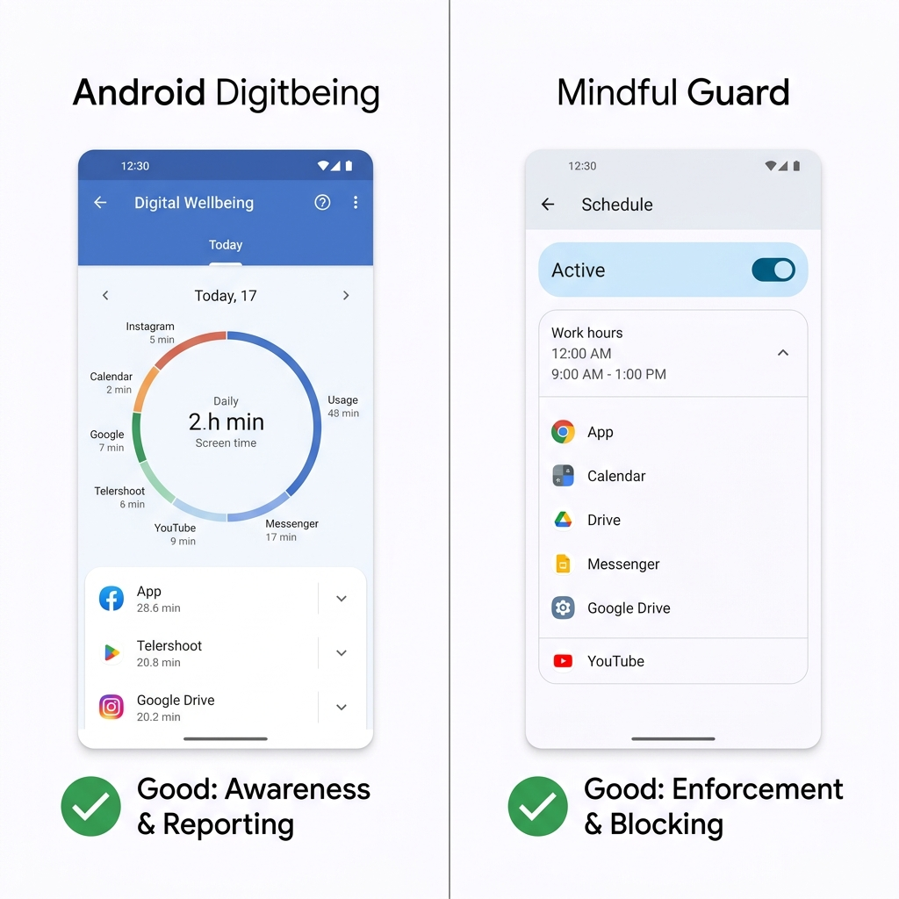
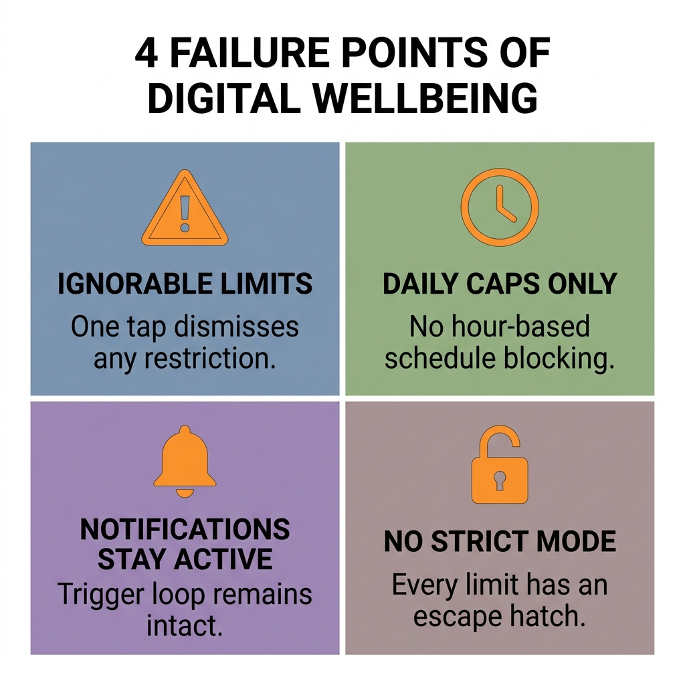
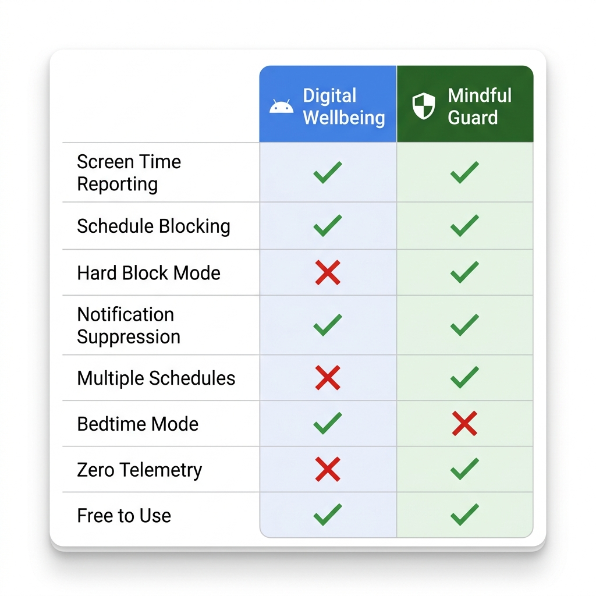

Quand Android a introduit le Bien-être numérique en 2018, cela semblait être la bonne décision. Une grande plateforme reconnaissant que le temps d'écran était un problème et construisant des outils pour y remédier directement — c'était un progrès.

Huit ans plus tard, l'évaluation honnête est plus nuancée.

Le Bien-être numérique est toujours là, toujours peu changé, et toujours fondé sur la même hypothèse de conception fondamentale qui a causé des problèmes dès le départ : que les gens ont principalement besoin d'*informations* sur leurs habitudes téléphoniques, pas d'une *application* de meilleures habitudes.

Si vous avez déjà fixé une limite quotidienne de 30 minutes sur Instagram, vu la notification apparaître à 29 minutes, et appuyé sur « Ignorer pour aujourd'hui » — vous comprenez déjà l'écart dont parle cet article.

Ce n'est pas un article à charge contre le Bien-être numérique. Il fait certaines choses vraiment bien. Mais si vous lisez ceci, vous avez probablement déjà senti qu'il ne résout pas votre problème de concentration. Cette comparaison vous montrera exactement pourquoi, à quoi ressemble une alternative plus efficace, et comment décider quel outil — ou combinaison d'outils — convient à votre situation.

---

## Ce que le Bien-être Numérique Fait Vraiment Bien

Avant d'aborder les limites, il vaut la peine d'être honnête sur les domaines où le Bien-être numérique apporte vraiment quelque chose.

**Les rapports de temps d'écran** sont précis et utiles. Les résumés hebdomadaires montrant vos applications les plus utilisées, l'utilisation quotidienne totale et la fréquence de déverrouillage vous donnent des données réelles sur vos habitudes. Cette couche de sensibilisation a de la valeur — vous ne pouvez pas changer un comportement que vous ne voyez pas.

**Le mode coucher** est sous-estimé. La fonctionnalité qui passe votre écran en niveaux de gris et réduit les notifications après une heure définie est simple, efficace, et aide genuinement avec l'habitude de défilement pré-sommeil qui ruine la qualité du sommeil de beaucoup de personnes.

**Le mode concentration** fonctionne bien pour de courtes sessions de travail intentionnelles. Appuyez pour activer, choisissez vos applications bloquées, réglez une minuterie. Pour des sessions structurées de type Pomodoro où vous êtes déjà motivé et avez juste besoin d'un coup de pouce, c'est adéquat.

**L'absence de friction de configuration** est un vrai avantage. Le Bien-être numérique est préinstallé, ne nécessite pas de permissions supplémentaires au-delà de ce qu'Android a déjà, et la plupart des utilisateurs peuvent définir une limite de temps de base en moins de deux minutes.

Pour quelqu'un qui veut juste avoir une idée générale du temps qu'il passe sur son téléphone et qui souhaite parfois se déconnecter quelques heures, le Bien-être numérique convient. Le problème commence quand vous avez besoin qu'il fasse plus que ça.

---

---

## Où le Bien-être Numérique Est Insuffisant

### Le Problème du « Ignorer pour Aujourd'hui »

C'est l'échec central de la conception du Bien-être numérique, et il découle d'un choix philosophique qui s'avère erroné en pratique.

Le Bien-être numérique traite l'utilisation excessive du téléphone comme un problème de sensibilisation. L'hypothèse est la suivante : si vous savez que vous avez utilisé Instagram pendant 30 minutes, vous choisirez d'arrêter. Le bouton « Ignorer pour aujourd'hui » existe parce que les concepteurs croyaient que les utilisateurs devaient toujours conserver le contrôle ultime.

En théorie, cela semble respectueux de l'autonomie de l'utilisateur. En pratique, cela signifie que le système n'a aucun pouvoir d'application réel. Au moment où vous voyez cette notification et ressentez l'envie de continuer à défiler, le bouton de dérogation est là — et l'appuyer demande moins d'effort cognitif que s'arrêter. Vous allez l'appuyer. Presque tout le monde le fait.

Ce n'est pas un défaut de caractère. C'est le résultat prévisible d'un système qui exige de la volonté exactement au moment où la volonté est la plus épuisée.

### Limites de Temps Sans Programmation

Les limites de temps du Bien-être numérique sont des plafonds quotidiens, pas des blocages programmés. Vous avez 30 minutes d'Instagram par jour — mais vous pouvez utiliser les 30 minutes à 7h du matin si vous voulez, sans rien appliquer pour le reste de la journée.

Ce dont la plupart des gens ont réellement besoin, ce n'est pas un plafond quotidien mais un blocage basé sur des fenêtres : Instagram est indisponible de 9h à 17h, quelle que soit la quantité utilisée. C'est une contrainte fondamentalement différente, et le Bien-être numérique ne l'offre pas.

### Les Notifications Continuent de Passer

Même quand une application a atteint sa limite de temps, le Bien-être numérique ne bloque pas ses notifications. Votre badge Instagram montre toujours de nouveaux likes. Vos notifications Reddit sonnent toujours. Les signaux visuels et auditifs qui déclenchent l'habitude d'ouverture restent pleinement actifs — ce qui signifie que la boucle de tentation commence même quand l'application est techniquement restreinte.

### Pas de Mode Strict

Il n'existe aucune configuration dans le Bien-être numérique qui rende les limites véritablement impossibles à contourner. Chaque restriction a une échappatoire. Pour les personnes qui essaient sérieusement de changer une habitude téléphonique profondément enracinée, cela rend l'outil fonctionnellement inutile pendant les moments les plus difficiles — qui sont exactement les moments où l'outil est censé aider.

### Données et Confidentialité

Le Bien-être numérique envoie des données d'utilisation à Google dans le cadre de l'écosystème de télémétrie Android plus large. Pour la plupart des utilisateurs, c'est une préoccupation mineure, mais pour quiconque est sérieusement préoccupé par la confidentialité numérique — ou qui ne veut tout simplement pas que ses habitudes d'utilisation des applications soient enregistrées et associées à son compte Google — c'est une considération pertinente.

---

---

## Comment Mindful Guard Comble le Vide

Mindful Guard a été construit autour d'une hypothèse de conception différente : que le problème n'est pas la sensibilisation, c'est l'architecture. Les gens savent généralement qu'ils utilisent trop leur téléphone. Ce dont ils ont besoin, c'est d'un système qui rend la distraction structurellement plus difficile, pas d'un tableau de bord qui leur montre à quel point ils ont été distraits.

Voici comment cela se traduit en pratique dans les mêmes dimensions où le Bien-être numérique est insuffisant.

### Blocages Horaires Stricts

Mindful Guard bloque les applications par fenêtre horaire, pas par plafond quotidien. Vous définissez un programme — 9h à 17h, du lundi au vendredi — et pendant cette fenêtre, les applications bloquées ne s'ouvrent tout simplement pas. Il n'y a pas de notification vous demandant si vous voulez l'ignorer. Il n'y a pas d'allocation quotidienne que vous pouvez utiliser en avance. La fenêtre est la règle.

C'est la différence la plus importante. Elle supprime entièrement la décision pendant vos heures de concentration définies, ce qui est la seule approche qui fonctionne de manière fiable quand la motivation est faible.

### Mode Strict Sans Dérogation

En Mode Strict, il n'y a pas de bouton de dérogation sur l'écran de blocage. L'application est indisponible jusqu'à l'expiration du programme. Cela semble sévère, mais c'est ce que nécessite une concentration sérieuse — un système qui tient la ligne lors de vos pires journées, pas seulement lors de vos meilleures.

Le Mode Standard existe toujours pour les utilisateurs qui ont besoin d'un accès légitime occasionnel aux applications bloquées. Mais la possibilité d'être strict est là quand vous en êtes prêt.

### Suppression des Notifications

Quand Mindful Guard bloque une application, ses notifications sont supprimées simultanément. Pas de badges, pas de sons, pas de bannières. La boucle de déclenchement — notification → envie → ouvrir l'application — est brisée à la première étape, là où elle doit l'être.

### Architecture Zéro Télémétrie

Mindful Guard fonctionne entièrement sur l'appareil. Il ne nécessite que la permission d'Accès à l'utilisation — la permission Android standard pour surveiller les applications au premier plan — et ne collecte aucune donnée personnelle, aucun journal d'utilisation et aucun identifiant. Rien ne quitte votre téléphone. Pour les utilisateurs déjà préoccupés par la confidentialité des données, c'est une distinction significative par rapport à un outil natif Google.

### Plusieurs Profils de Programme

Vous pouvez créer différents programmes pour différents contextes — un blocage matinal strict de 6h à 8h, un blocage de travail de 9h à 17h, un blocage de détente en soirée plus léger. Chaque programme a sa propre liste d'applications et son propre mode de blocage. La flexibilité vous permet d'adapter le système à votre vie réelle plutôt que de forcer votre vie dans une seule limite quotidienne.

---

## Comparaison Directe

| Fonctionnalité | Bien-être Numérique | Mindful Guard |
|---|---|---|
| Rapports de temps d'écran | ✅ Oui | ❌ Non |
| Blocage programmé | ❌ Non | ✅ Oui |
| Blocage strict (sans dérogation) | ❌ Non | ✅ Mode Strict |
| Suppression des notifications | ❌ Non | ✅ Oui |
| Plusieurs profils de programme | ❌ Non | ✅ Oui |
| Mode coucher / niveaux de gris | ✅ Oui | ❌ Non |
| Zéro télémétrie | ❌ Non | ✅ Oui |
| Préinstallé | ✅ Oui | ❌ Installation requise |
| Gratuit | ✅ Oui | ✅ Oui |

Le schéma est clair : le Bien-être numérique gagne sur la sensibilisation et la commodité. Mindful Guard gagne sur l'application et la confidentialité. Ils résolvent des problèmes différents.

---

---

## Lequel Devriez-Vous Utiliser ?

La réponse dépend de l'état de vos habitudes téléphoniques.

**Utilisez le Bien-être numérique si :**
- Vous voulez une compréhension de base de votre temps d'écran sans rien installer de nouveau
- Votre utilisation du téléphone semble gérable et vous voulez juste des rappels doux occasionnels
- Vous avez principalement besoin du mode coucher ou du mode niveaux de gris pour mieux dormir
- Vous n'avez jamais essayé d'outil de concentration et voulez commencer sans friction

**Utilisez Mindful Guard si :**
- Vous avez essayé les limites de temps du Bien-être numérique et vous êtes retrouvé à les ignorer
- Vous avez besoin que les applications soient véritablement indisponibles pendant des heures de travail spécifiques
- Vous voulez la suppression des notifications en plus du blocage des applications
- La confidentialité compte pour vous et vous préférez une architecture zéro télémétrie
- Vous avez essayé des approches basées sur la volonté et elles n'ont pas tenu

**Utilisez les deux si :**
- Vous voulez le tableau de bord de rapports du Bien-être numérique pour une prise de conscience passive
- Et l'application des programmes de Mindful Guard pour une protection active de la concentration

C'est en fait la configuration la plus complète. Le Bien-être numérique vous dit ce qui se passe avec votre temps d'écran au fil du temps. Mindful Guard empêche le pire de se produire pendant vos heures les plus importantes. Ils ne se chevauchent pas — ils se complètent.

---

## La Conclusion Honnête

Le Bien-être numérique est un outil bien intentionné qui résout le mauvais problème. Il suppose que vous avez besoin d'informations. La plupart des gens qui luttent contre la distraction par téléphone ont déjà les informations — ils savent qu'ils sont trop sur leur téléphone, ils savent quelles applications posent problème, et ils savent quand ça arrive. Ce qui leur manque, c'est un système qui maintient la limite quand leur moi du moment ne le veut pas.

Mindful Guard est ce système. Ce n'est pas un remplacement pour les fonctionnalités de rapports du Bien-être numérique, mais pour la partie qui compte vraiment — vous tenir éloigné des applications distrayantes pendant les heures où votre concentration a le plus de valeur — il fait ce que le Bien-être numérique ne peut pas faire.

L'objectif n'est pas de trouver l'application parfaite. C'est de construire un environnement où le travail concentré est le chemin de moindre résistance. Ces deux outils, utilisés ensemble, vous rapprochent de cet environnement plus que l'un ou l'autre seul.

> **Prêt à ajouter une vraie application à votre configuration de concentration ?** [Mindful Guard](https://play.google.com/store/apps/details?id=com.anonymous.mindfulguard&referrer=utm_source%3Dapplass%26utm_medium%3Dblog%26utm_campaign%3Dandroid-digital-wellbeing-vs-third-party-focus-apps%26utm_content%3Dinline) est gratuit, ne nécessite aucun compte et prend moins de 5 minutes à configurer. Zéro donnée collectée. Entièrement sur l'appareil.
>
> **[Télécharger Mindful Guard Gratuitement sur Google Play →](https://play.google.com/store/apps/details?id=com.anonymous.mindfulguard&referrer=utm_source%3Dapplass%26utm_medium%3Dblog%26utm_campaign%3Dandroid-digital-wellbeing-vs-third-party-focus-apps%26utm_content%3Dinline)**

---

**À lire aussi :** Maintenant que vous comprenez les outils, lisez comment [bloquer les réseaux sociaux sur Android pendant les heures de travail uniquement](/fr/blog/bloquer-reseaux-sociaux-android-heures-travail/) pour un guide de configuration étape par étape qui met Mindful Guard au travail immédiatement.