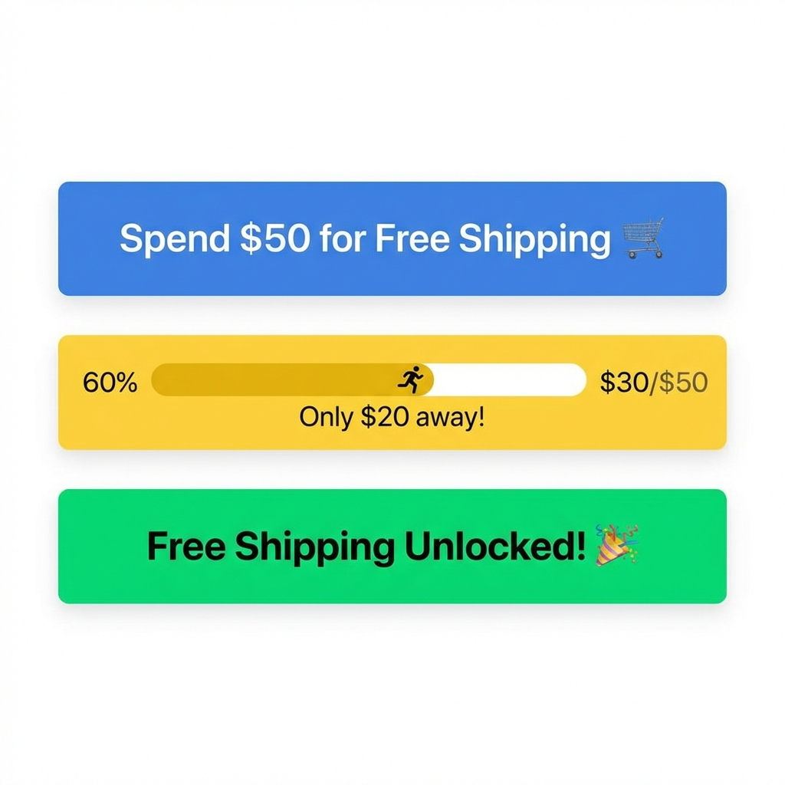

La livraison gratuite est le premier facteur d'incitation pour les acheteurs en ligne. En effet, 75 % des consommateurs s'attendent à une livraison gratuite sur les commandes de moins de 50 $.

Mais si vous offrez la livraison gratuite sur tout, vous mettez votre rentabilité en danger. Le secret consiste à définir un **seuil de livraison gratuite** qui incite les clients à ajouter « un article de plus » à leur panier, augmentant ainsi votre panier moyen.

## La Logique Mathématique : Trouver Votre Nombre Optimal

Ne devinez pas. Vous devez calculer un seuil qui couvre vos frais d'expédition tout en restant psychologiquement atteignable pour le client.

**La Formule :**
`Seuil = (Coût d'expédition moyen / Marge brute) + Panier moyen`

### Exemple :

- **Panier moyen :** 40 $
- **Coût d'expédition moyen :** 8 $
- **Marge brute :** 40 % (0,40)

### Calcul :

1. Divisez le coût d'expédition par la marge : 8 $ / 0,40 = 20 $
2. Ajoutez au panier moyen : 20 $ + 40 $ = 60 $

Votre seuil devrait être fixé à **60 $**.
À ce niveau, le profit supplémentaire généré par la vente additionnelle couvre intégralement les frais d'expédition.

## Gamifier l'Expérience Client

Une fois votre seuil défini (par exemple 60 $), vous devez le rendre visible. Ne le cachez pas dans une page de conditions générales. Utilisez une **barre de livraison gratuite progressive**.

- **Étape 1 :** Le client ajoute un produit à 40 $ dans son panier.
- **Mise à jour dynamique :** *« Plus que 20 $ pour bénéficier de la livraison gratuite ! »*
- **Psychologie :** Cela active l'**effet de gradient de but** — les gens accélèrent leur comportement à mesure qu'ils se rapprochent d'un objectif.

## Maîtriser Vos Marges

Le calcul stratégique du seuil est un pilier fondamental de la performance e-commerce. En maîtrisant cette logique, vous protégez vos marges tout en stimulant votre croissance.

## Conclusion

Mettre en place une barre de livraison dynamique est l'un des moyens les plus rapides d'augmenter votre chiffre d'affaires jusqu'à 30 %.

Utilisez la formule ci-dessus, configurez votre objectif dans FOMO Gen, et regardez votre panier moyen grimper.