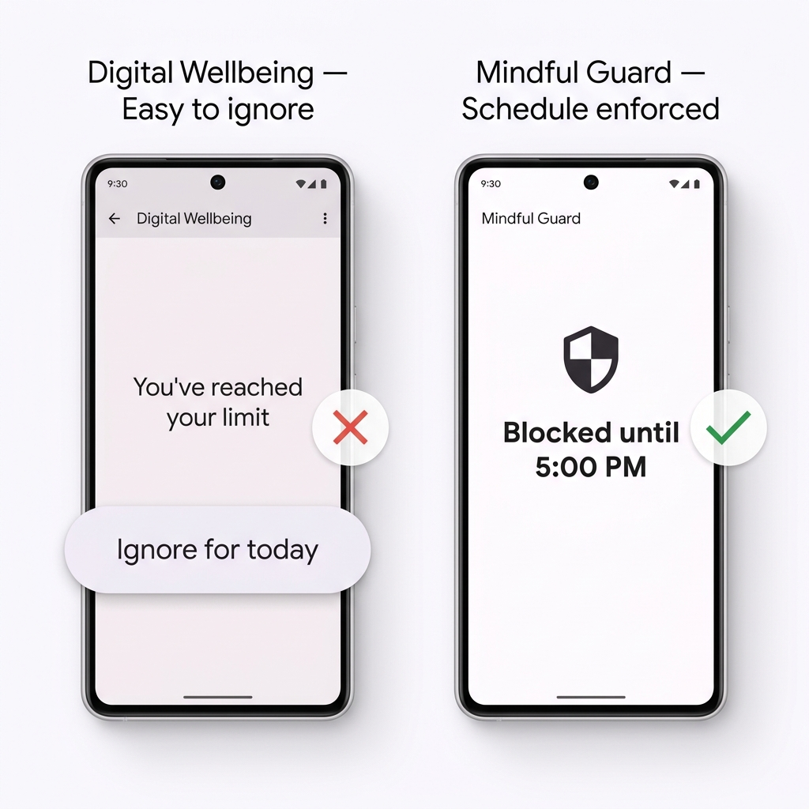
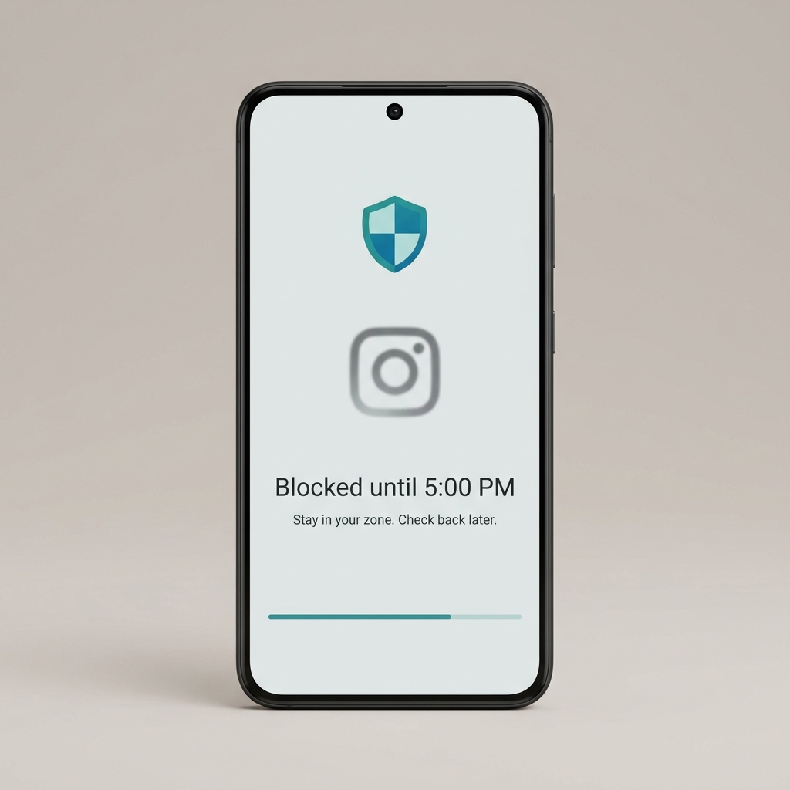
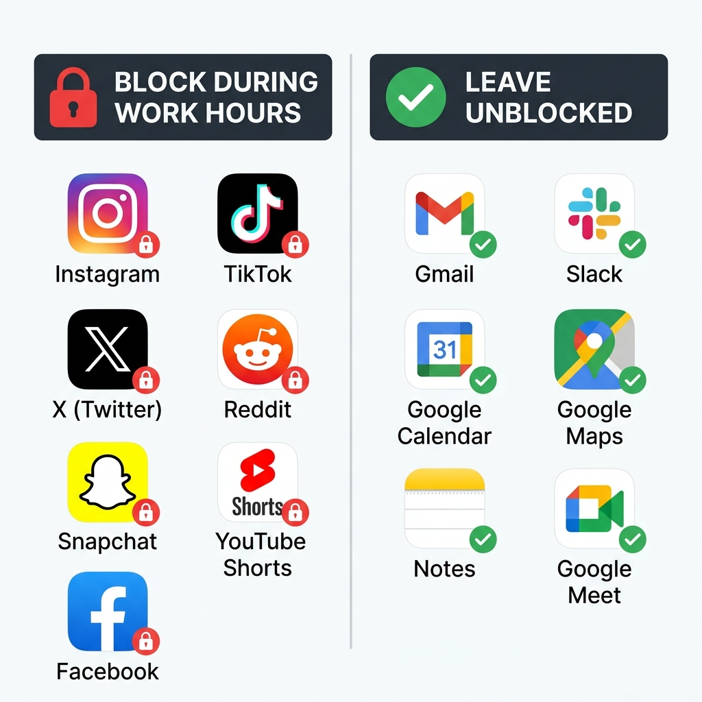

Vous avez essayé de supprimer les applications. Vous les avez réinstallées trois jours plus tard.

Vous avez essayé la limite de 30 minutes par jour dans Bien-être numérique. Vous avez appuyé sur « Ignorer pour aujourd'hui » avant midi.

Vous avez essayé d'être plus discipliné. Ça a tenu jusqu'au mardi.

Rien n'a fonctionné — non pas parce que vous manquez de volonté, mais parce que vous utilisiez le mauvais outil. La volonté est une ressource qui s'épuise. L'équipe d'ingénierie d'Instagram, elle, ne s'épuise pas. Chaque notification, chaque vidéo en lecture automatique, chaque défilement infini est le fruit de milliers d'heures de recherche en psychologie comportementale conçues pour vous maintenir dans l'application. Vous ne pouvez pas battre par la discipline un système conçu pour vaincre la discipline.

La seule solution fiable est de supprimer la décision entièrement. Pas définitivement — juste pendant les heures où votre temps a le plus de valeur.

C'est ce que fait le blocage programmé. Vos réseaux sociaux sont simplement inaccessibles de 9h à 17h. Pas d'écran de tentation, pas de « juste une vérification rapide », aucune volonté requise. À 17h, tout se débloque automatiquement. Vous n'avez pas quitté les réseaux sociaux. Vous les avez juste rendus structurellement inaccessibles quand c'est le plus important.

Ce guide vous explique comment le configurer sur Android en moins de 5 minutes avec Mindful Guard.

---

## Pourquoi le Blocage Programmé Fonctionne Là Où Tout le Reste Échoue

Avant d'entrer dans la configuration, il est utile de comprendre pourquoi cette approche est différente — parce que si vous avez déjà essayé des bloqueurs d'applications et les avez désinstallés, cela peut ressembler à la même chose.

La plupart des bloqueurs d'applications échouent pour l'une de ces deux raisons :

**1. Ils sont trop faciles à contourner.** Le limiteur de temps de Bien-être numérique affiche un bouton de renvoi. Beaucoup de bloqueurs ont une option « pause pendant 15 minutes ». Toute friction qui peut être contournée d'une simple pression sera contournée — surtout quand votre système dopaminergique est déjà activé et cherche le chemin de moindre résistance.

**2. Ils bloquent trop agressivement.** Bloquer toutes les applications de façon permanente, et le bloqueur devient l'ennemi. Vous le désinstallez, restaurez tout, et vous sentez pire qu'au départ.

Le blocage programmé résout ces deux problèmes. C'est un blocage dur — sans option de dérogation pendant votre fenêtre définie — mais c'est aussi un blocage *délimité*. Vous savez exactement quand il se termine. Cette prévisibilité est psychologiquement importante : ça ne ressemble pas à une privation, ça ressemble à une règle avec une fin clairement définie, que votre cerveau est bien plus disposé à accepter.

La neuroscience ici est simple. Les boucles d'habitudes sont déclenchées par des signaux — dans ce cas, le signal est l'ennui ou le stress, et la routine est d'ouvrir une application sociale. Quand l'application est structurellement inaccessible, la routine est brisée avant même de commencer. Après quelques jours, le cerveau cesse d'initier la boucle parce qu'il a appris que la récompense n'est pas accessible. L'envie diminue non pas par la volonté, mais par des signaux répétés et interrompus.

---

---

## Comment Bloquer les Réseaux Sociaux Pendant les Heures de Travail sur Android

### Étape 1 : Télécharger Mindful Guard

Installez [Mindful Guard](https://play.google.com/store/apps/details?id=com.anonymous.mindfulguard&referrer=utm_source%3Dapplass%26utm_medium%3Dblog%26utm_campaign%3Dhow-to-block-social-media-on-android-during-work-hours%26utm_content%3Dinline) depuis le Google Play Store. C'est gratuit, sans compte, sans inscription et sans adresse e-mail.

### Étape 2 : Accorder l'Accès à l'Utilisation

Au premier lancement, Mindful Guard demandera la permission d'Accès à l'utilisation. C'est ainsi qu'il détecte quelle application est au premier plan pour pouvoir appliquer les blocages.

Pour l'accorder : allez dans **Paramètres → Bien-être numérique et contrôle parental → Accès à l'utilisation**, trouvez Mindful Guard dans la liste et activez-le.

C'est la seule permission dont l'application a besoin. Elle ne demande pas la localisation, les contacts, la caméra, le microphone ou toute autre permission sensible. Tout le traitement se fait sur l'appareil.

### Étape 3 : Créer Votre Programme d'Heures de Travail

Appuyez sur **Programmes → Nouveau Programme** et renseignez les informations suivantes :

- **Nom du programme :** Heures de travail
- **Heure de début :** 9h00
- **Heure de fin :** 17h00
- **Jours actifs :** Lundi, Mardi, Mercredi, Jeudi, Vendredi

Vous pouvez ajuster ces horaires selon vos vraies heures de travail. L'objectif est de définir une fenêtre où votre travail concentré se produit — et de bloquer les distractions exactement pendant cette fenêtre, rien de plus.

### Étape 4 : Sélectionner les Applications à Bloquer

Appuyez sur **Ajouter des Applications** et choisissez celles qui vous coûtent le plus de temps pendant les heures de travail. Si vous ne savez pas par où commencer, voici les coupables les plus courants :

- Instagram
- TikTok
- YouTube *(ou spécifiquement YouTube Shorts)*
- X (Twitter)
- Reddit
- Snapchat
- Facebook

Un test utile : ouvrez votre rapport de temps d'écran Android et triez par moyenne quotidienne. Les trois ou quatre premières applications non professionnelles constituent votre liste de blocage. Ne bloquez pas excessivement — ajouter 15 applications à la liste donne l'impression d'une cage, ce qui augmente l'envie de désinstaller.

### Étape 5 : Choisir Votre Mode de Blocage

Mindful Guard vous propose deux options :

**Mode Standard** — Quand vous essayez d'ouvrir une application bloquée, un écran de blocage apparaît avec la possibilité de demander une courte fenêtre de dérogation. Utile si votre travail nécessite occasionnellement l'accès aux réseaux sociaux.

**Mode Strict** — Aucune dérogation. L'écran de blocage est la fin de la route jusqu'à l'expiration de votre programme. Recommandé si vous avez remarqué que vous justifiez des dérogations qui n'étaient pas vraiment nécessaires.

Si c'est la première fois que vous configurez un système comme celui-ci, commencez par le Mode Standard. Donnez-lui une semaine. Si vous utilisez la dérogation plus d'une ou deux fois par jour, passez au Mode Strict.

### Étape 6 : Activer le Programme

Appuyez sur **Enregistrer**, puis activez le programme.

Pour vérifier que ça fonctionne : essayez d'ouvrir une de vos applications bloquées maintenant. Vous devriez voir immédiatement l'écran de blocage de Mindful Guard. Revenez à 17h — elle s'ouvre normalement sans aucune action de votre part.

C'est toute la configuration.

---

---

## Quelles Applications Bloquer — et Lesquelles Laisser Ouvertes

Être stratégique dans votre liste de blocage est aussi important que la configuration elle-même. Trop étroite et ça n'aide pas. Trop large et ça devient punitif.

Voici un cadre simple :

**Bloquez tout ce qui offre un défilement infini ou une lecture automatique.**
Ce sont les applications les plus risquées car il n'y a pas de point d'arrêt naturel. Une vidéo en entraîne une autre. Un post mène à un fil d'actualité. La durée de la session est déterminée par l'algorithme, pas par vous.

**Bloquez tout ce qui crée des boucles d'anxiété sociale.**
Vérifier combien de likes a eu votre publication, rafraîchir pour voir si quelqu'un a répondu, lire les commentaires d'un post où vous êtes tagué — ce sont des comportements de vérification compulsive, pas des actions intentionnelles. Le blocage supprime le déclencheur.

**Ne bloquez pas les outils dont vous avez besoin pour faire votre travail.**
Gmail, Slack, Google Meet, votre application de gestion de projet — celles-ci restent ouvertes. L'objectif est le travail concentré, pas un jeûne numérique.

**Ne bloquez pas tout à la fois.**
Si votre travail implique la gestion des réseaux sociaux, bloquez les comptes personnels et laissez les comptes professionnels. Si vous utilisez Reddit pour des recherches professionnelles, envisagez d'y accéder via un navigateur avec une limite de temps.

---

---

## À Quoi S'Attendre la Première Semaine

Les premiers jours se passent différemment de ce que la plupart des gens imaginent. Voici le calendrier honnête :

**Jours 1–2 : Le geste fantôme.**
Vous appuierez instinctivement à l'endroit de votre écran d'accueil où Instagram se trouvait, ou vous déverrouillerez votre téléphone sans intention claire et ne trouverez rien à ouvrir. C'est légèrement inconfortable. Cet inconfort, c'est la boucle d'habitude qui échoue à se compléter — c'est exactement ce que vous voulez.

**Jours 3–4 : Le geste diminue.**
Votre cerveau a commencé à mettre à jour ses attentes. Vous cessez de naviguer automatiquement vers les applications bloquées parce que vous avez appris qu'elles ne s'ouvriront pas. Certaines personnes remarquent qu'elles décrochent leur téléphone moins souvent en général pendant cette phase.

**Jours 5–7 : Des sessions de concentration plus longues sans effort.**
Le résultat le plus fréquemment rapporté. Pas « je me suis forcé à me concentrer pendant deux heures » — plutôt « j'ai levé les yeux et une heure s'était écoulée sans que j'attrape mon téléphone. » La différence est que la distraction a été supprimée au niveau du système, pas résistée au niveau cognitif.

Ce n'est pas une transformation spectaculaire. C'est une transformation silencieuse. Le travail devient plus facile non pas parce que vous êtes devenu plus discipliné, mais parce que le chemin de moindre résistance a changé.

---

## Cumulez les Programmes pour un Impact Maximum

Le blocage des heures de travail est la base. Une fois qu'il fonctionne bien, envisagez d'ajouter un deuxième programme pour protéger vos matins.

Les 60 à 90 premières minutes après le réveil sont celles où votre cortex préfrontal — la partie du cerveau responsable de la concentration, de la planification et de la prise de décision rationnelle — est le plus actif. Ouvrir les réseaux sociaux pendant cette fenêtre ne fait pas que gaspiller du temps ; cela définit le ton cognitif de toute la matinée en entraînant votre cerveau à attendre de courtes boucles dopaminergiques avant que tout travail soutenu n'ait eu lieu.

Un programme matinal simple ressemble à ceci :

- **Blocage matinal :** 6h00 – 8h00
- **Blocage heures de travail :** 9h00 – 17h00
- **Week-ends :** Désactivé (ou un blocage matinal plus léger)

Trois minutes à configurer. Cela protège les deux fenêtres de votre journée où la distraction fait le plus de dégâts.

---

## L'Idée Centrale : Les Systèmes Battent la Volonté à Chaque Fois

Il existe une version des conseils de productivité qui traite la discipline comme une compétence que l'on développe par l'effort — que si vous essayez juste plus fort et le voulez davantage, vous arrêterez d'être distrait. Ce conseil est non seulement faux, mais contre-productif, car il fait de chaque échec un défaut de caractère personnel plutôt qu'un problème de conception de système.

Le cadrage plus précis : votre environnement détermine votre comportement plus que vos intentions. Quand le chemin de moindre résistance mène au travail concentré, la plupart des gens travaillent de façon concentrée. Quand il mène à Instagram, la plupart des gens ouvrent Instagram.

Le blocage programmé change le chemin de moindre résistance pendant les heures qui comptent. Ce n'est pas un outil de motivation. C'est un outil architectural. Et contrairement à la motivation, l'architecture n'a pas de mauvais jours.

> **Prêt à protéger vos heures de travail ?** [Mindful Guard](https://play.google.com/store/apps/details?id=com.anonymous.mindfulguard&referrer=utm_source%3Dapplass%26utm_medium%3Dblog%26utm_campaign%3Dhow-to-block-social-media-on-android-during-work-hours%26utm_content%3Dinline) est gratuit, entièrement sur l'appareil et prend moins de 5 minutes à configurer. Zéro donnée collectée. Zéro abonnement requis.
>
> **[Télécharger Mindful Guard sur Google Play →](https://play.google.com/store/apps/details?id=com.anonymous.mindfulguard&referrer=utm_source%3Dapplass%26utm_medium%3Dblog%26utm_campaign%3Dhow-to-block-social-media-on-android-during-work-hours%26utm_content%3Dinline)**

---

<!-- **À lire aussi :** Maintenant que vos heures de travail sont protégées, découvrez comment [configurer un téléphone Android minimaliste pour le travail en profondeur](/fr/blog/configuration-android-minimaliste-travail-profond/) — un guide complet de configuration qui supprime toutes les sources de friction restantes entre vous et votre meilleur travail. -->