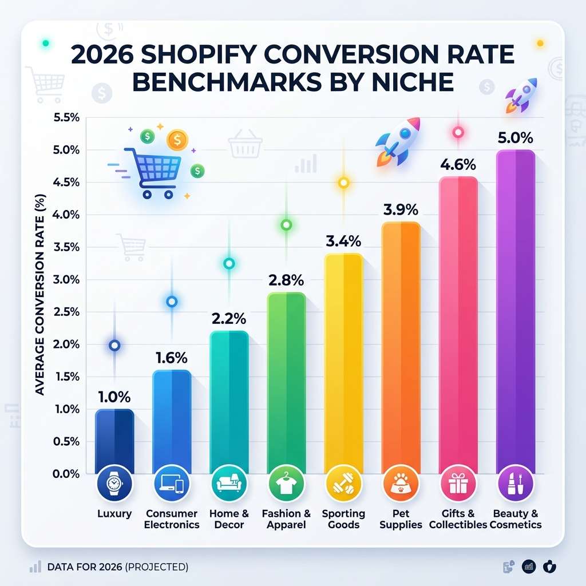
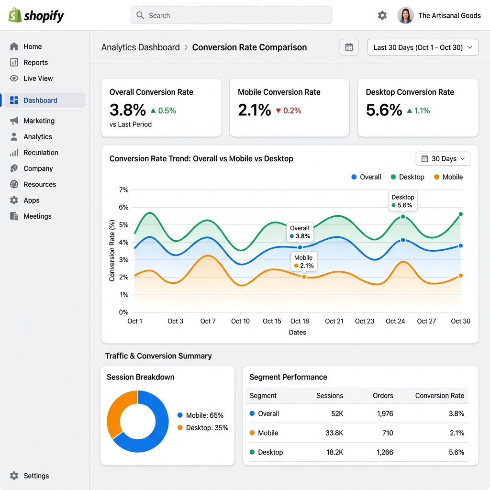
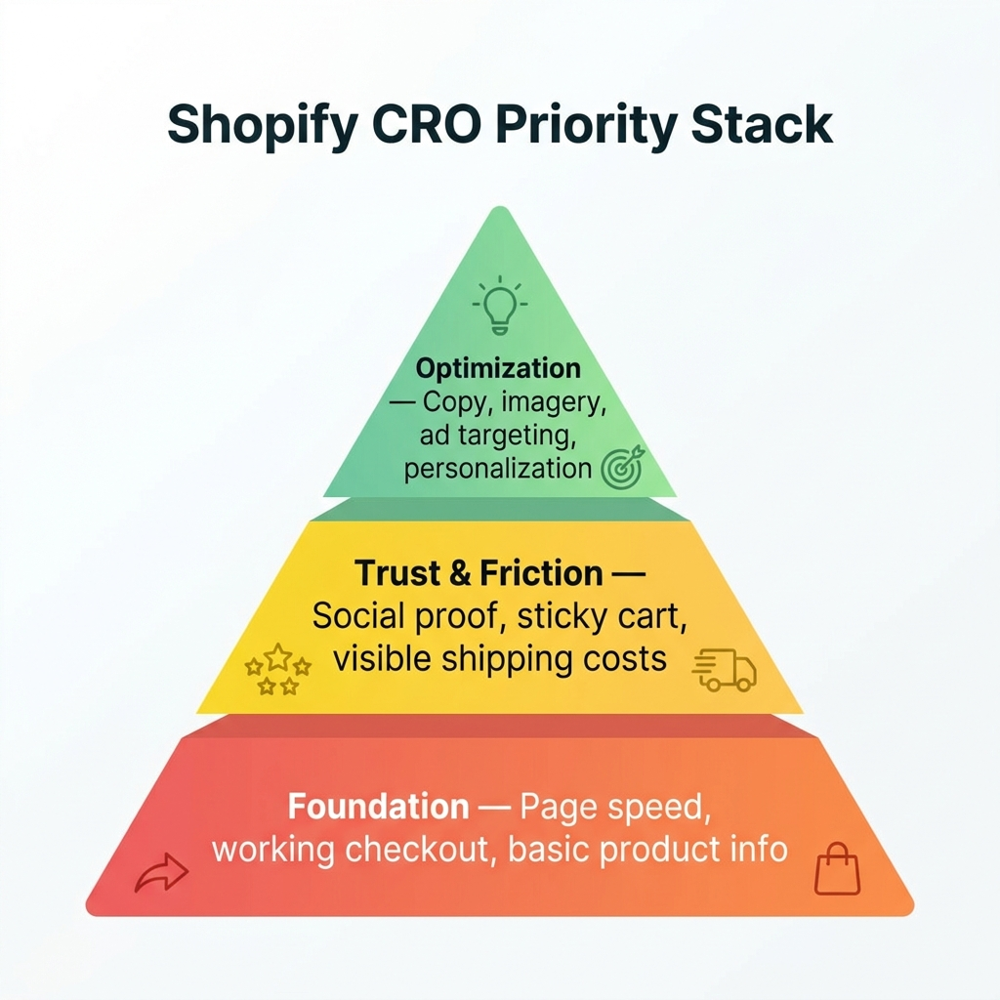

Si vous avez déjà cherché "quel est un bon taux de conversion Shopify", on vous a probablement dit que la réponse est environ 2 à 3 %.

Ce chiffre est surtout inutile.

Voici pourquoi : cette moyenne inclut des boutiques toutes neuves qui n'ont encore rien vendu, des boutiques avec un tunnel de paiement cassé, des boutiques qui reçoivent du trafic non pertinent à cause de mauvaises pubs, et des boutiques créées comme expériences et jamais retouchées.

Le chiffre dont vous avez vraiment besoin, c'est **ce qu'une boutique bien gérée dans votre niche spécifique devrait convertir.**

C'est l'objet de cet article. On a rassemblé les données de benchmark 2026 de plusieurs études — l'analyse de Littledata sur 2 800 boutiques Shopify, les benchmarks internes de Shopify, et les données sectorielles d'IRP Commerce — et on les a décomposées par niche pour que vous puissiez vraiment comparer ce qui se compare.

---

## Pourquoi le Taux de Conversion Varie Autant Selon la Niche

Avant d'en venir aux chiffres, il vaut la peine de comprendre *pourquoi* les taux de conversion sont si différents d'un secteur à l'autre.

**Le prix et le risque d'achat** sont les facteurs les plus importants. Quand quelqu'un dépense 14 € pour un gel douche, les enjeux sont faibles. Si c'est mauvais, il est sorti de 14 €. Il est plus enclin à acheter sur un coup de tête et moins susceptible de passer du temps à faire des recherches. Quand quelqu'un dépense 1 400 € pour un meuble, il doit y réfléchir, mesurer sa pièce, en parler à son partenaire, comparer d'autres options. Plus de recherche = plus de sessions = taux de conversion plus faible.

**La fréquence d'achat** compte aussi. Si quelqu'un achète sa protéine en poudre chaque mois, il sait ce qu'il veut et le paiement est rapide. S'il achète un objectif photo pour la première fois, il visitera cinq boutiques, regardera trois avis YouTube, et reviendra sur plusieurs sessions.

**La tangibilité du produit** joue un rôle. Les vêtements, les bijoux et les meubles sont difficiles à acheter en ligne parce qu'on ne peut pas les essayer. Cette hésitation se reflète dans les taux de conversion.

Gardez ça à l'esprit en regardant les benchmarks ci-dessous — vous n'essayez pas d'atteindre les chiffres du secteur beauté si vous vendez des meubles.

---

---

## Les Benchmarks 2026 par Niche

Voici où devrait se trouver votre boutique — basé sur des données agrégées de plusieurs études couvrant 2025 à 2026.

### Cadeaux & Spécialités : 4,5–5,0 %
Cette catégorie convertit systématiquement le mieux parce que la décision d'achat est généralement simple (c'est un cadeau, quelqu'un d'autre va l'utiliser) et les articles sont des achats à faible risque. La motivation émotionnelle est forte — les gens *veulent* offrir quelque chose de bien. Si vous êtes dans cet espace et que vous convertissez en dessous de 3 %, quelque chose est cassé dans votre tunnel.

### Beauté & Soins : 4,5–4,9 %
La beauté est une catégorie d'achat récurrent avec une forte fidélité de marque. Une fois que quelqu'un trouve une crème hydratante ou un sérum qu'il aime, il revient tous les 6 à 8 semaines. La preuve sociale (avis, photos, mentions d'influenceurs) est extrêmement efficace ici — les gens font davantage confiance aux résultats sur la peau des autres qu'aux descriptions de produit.

### Alimentation & Boissons : 3,0–4,5 %
Grande fourchette parce que ça inclut à la fois des achats impulsifs (snacks artisanaux, sauce piquante artisanale) et des achats plus réfléchis (équipement café spécialisé). Les produits de consommation à faible friction dans cet espace convertissent très bien. Si vous êtes en dessous de 2 % ici, vos descriptions de produit et vos photos sont probablement en dessous.

### Santé & Bien-être : 3,0–3,5 %
Les compléments, équipements fitness et produits bien-être bénéficient d'une forte preuve sociale et de textes axés sur les bénéfices. L'hésitation "Est-ce que ça marche vraiment ?" est bien réelle — les boutiques qui y répondent avec des témoignages et des avis surpassent celles qui misent sur les ingrédients et les caractéristiques.

### Mode & Vêtements : 2,5–3,1 %
L'incertitude sur la taille, les préoccupations de coupe et les taux de retour élevés créent des frictions. Les boutiques en haut de cette fourchette proposent généralement des guides des tailles détaillés, plusieurs photos de produit (y compris sur mannequin), et des politiques de retour claires et visibles sur la page produit.

### Maison & Jardin : 2,1–2,8 %
Les produits maison impliquent souvent une période de réflexion plus longue — les gens mesurent les espaces, vérifient la compatibilité, consultent leur partenaire. De belles photos de produit montrant l'échelle, des clichés lifestyle "en situation", et de bons avis ont plus d'impact ici que les tactiques d'urgence.

### Électronique & High-Tech : 1,4–2,3 %
Longue période de recherche, prix élevés, et forte concurrence d'Amazon et des grandes enseignes font baisser les taux de conversion. La précision des caractéristiques, les détails de compatibilité et les signaux de confiance (garantie, politique de retour) comptent plus ici que partout ailleurs.

### Bijoux : 1,2–2,0 %
Les bijoux sont personnels, souvent chers, et difficiles à évaluer sur photos. Les boutiques qui proposent des vidéos de pièces portées, des descriptions de matériaux détaillées et des retours/échanges faciles convertissent systématiquement mieux que celles qui s'appuient uniquement sur des photos fixes.

### Luxe & Premium : 1,0–1,5 %
Faible conversion par conception — le parcours client pour un sac à 1 500 € ou une montre à 3 000 € implique plusieurs points de contact. Ne vous comparez pas aux boutiques grande consommation. Un taux de conversion de 1,2 % avec un panier moyen de 900 € est une entreprise plus rentable qu'un taux de 4 % avec un panier moyen de 22 €.

---

## Comment Calculer Votre Propre Taux de Conversion

Avant de vous benchmarker, assurez-vous de mesurer la bonne chose.

Le calcul par défaut de Shopify est :

**Taux de Conversion = Nombre Total de Commandes ÷ Sessions Totales × 100**

Vous trouvez ça dans : *Admin Shopify → Analytique → Rapports → Comportement → Taux de conversion de la boutique en ligne.*

Quelques points à vérifier :

**Ne regardez pas que les chiffres globaux.** Votre taux de conversion global cache ce qui se passe vraiment. Décomposez-le par :
- Mobile vs. ordinateur (généralement un écart de 1 à 2 % entre les deux)
- Source de trafic (la recherche organique convertit bien mieux que les réseaux sociaux payants)
- Nouveaux vs. visiteurs récurrents (les visiteurs récurrents devraient convertir à 2 à 3 fois le taux des nouveaux)

Si votre taux mobile est bien inférieur à votre taux bureau, votre expérience mobile a des problèmes de friction. Si votre trafic payant convertit bien moins que l'organique, vos pubs amènent la mauvaise audience.

---

---

## Les Raisons les Plus Fréquentes pour Lesquelles les Boutiques Convertissent En Dessous de Leur Benchmark

Une fois que vous savez où vous en êtes par rapport à votre niche, la question suivante est : pourquoi êtes-vous en dessous ?

Voici les cinq coupables les plus courants, dans l'ordre approximatif de fréquence :

### 1. Vitesse de chargement lente (surtout sur mobile)
C'est le tueur de conversion silencieux. Les données de Google sont claires : quand le temps de chargement mobile passe de 1 à 3 secondes, le taux de rebond augmente de 32 %. À 5 secondes, il monte de 90 %. Chaque application installée sur votre boutique Shopify ajoute du JavaScript à votre page. Faites un audit de vos applications — supprimez tout ce que vous n'utilisez pas activement, et assurez-vous que les applications que vous gardez se chargent de façon asynchrone.

### 2. Aucune preuve sociale sur les pages produit
Si vos pages produit ont zéro avis et aucune activité d'achat récente, vous demandez à des inconnus de vous faire confiance avec leur argent sans aucune preuve. C'est le principal moteur de "l'anxiété de paiement" — ce sentiment gênant que peut-être cette boutique n'est pas sérieuse. Même 5 à 10 avis genuins par produit fait une différence significative.

### 3. Frais de livraison surprises au paiement
Afficher des frais de livraison de 6,99 € pour la première fois à l'étape du paiement est l'une des principales raisons d'abandon de panier dans le monde entier. La solution est simple : montrez les frais de livraison tôt (sur la page produit ou dans une bannière persistante), ou configurez un seuil de livraison gratuite qui incite les clients à atteindre un montant minimum de panier.

### 4. Le bouton d'achat disparaît sur mobile
Sur la plupart des thèmes Shopify, le bouton Ajouter au Panier est en haut de la page produit. Une fois qu'un utilisateur mobile a fait défiler vers le bas pour lire les avis, le bouton a disparu. Ajouter une barre Ajouter au Panier sticky qui reste visible lors du défilement comble cet écart de façon significative — typiquement une hausse de 10 à 15 % de la conversion mobile à elle seule.

### 5. Mauvaise qualité du trafic
Parfois le problème n'est pas votre boutique — c'est qui vous y envoyez. Si vous diffusez des pubs auprès d'une audience large ou que vous vous positionnez sur des mots-clés qui ne correspondent pas à votre produit, vous aurez du trafic qui n'avait jamais l'intention d'acheter. Un taux de 0,3 % sur du trafic social payant est normal. Un taux de 0,3 % sur du trafic organique suggère que quelque chose va vraiment mal sur vos pages produit ou vos signaux de confiance.

---

## Un Plan Simple par Priorité

Selon où se situe votre taux de conversion par rapport au benchmark de votre niche, voici quoi traiter en premier :

**Si vous êtes à 50 % ou plus en dessous de votre benchmark :**
Commencez par les bases. Vérifiez la vitesse de la page, assurez-vous que le paiement marche sur mobile, et ajoutez au moins 5 à 10 avis sur vos 5 meilleurs produits. Ce sont des prérequis.

**Si vous êtes à 20 à 50 % en dessous de votre benchmark :**
Concentrez-vous sur les signaux de confiance et la réduction des frictions. Ajoutez de la preuve sociale (notifications de vente, nombre d'avis), améliorez votre expérience mobile (panier sticky), et rendez les frais de livraison visibles avant le paiement.

**Si vous êtes proche de votre benchmark :**
Vous faites les bases correctement. Pour entrer dans le top 20 % de votre niche, regardez les textes de vos pages produit, la qualité de vos images, et votre expérience post-clic depuis les pubs. Les gains marginaux s'accumulent.

---

---

## Les Outils Qui Font Bouger Ces Chiffres

**Pour la preuve sociale et la confiance :** [FomoGen](/apps/fomogen) — ajoute des notifications de vente, des alertes de stock et des badges de confiance. Plan gratuit disponible.

**Pour la friction mobile :** La barre panier sticky de FomoGen garde le bouton d'achat visible à chaque défilement. Voir le guide complet dans notre article sur le [Panier Sticky Mobile](/fr/blog/mobile-sticky-cart-guide/).

**Pour la livraison gratuite :** La barre de livraison de FomoGen montre aux clients exactement à combien ils sont de la livraison gratuite, augmentant le panier moyen en même temps que le taux de conversion.

**Pour la vitesse de page :** L'intégration PageSpeed Insights de Shopify dans l'éditeur de thème — commencez par supprimer les applications inutilisées, puis vérifiez la taille de vos images.

La plus grande erreur que font les marchands, c'est d'essayer de tout corriger en même temps. Choisissez le levier le plus loin en dessous du benchmark pour votre niche et travaillez uniquement sur celui-là pendant 30 jours avant de passer au suivant.

> **Benchmarkez votre boutique, puis corrigez la bonne chose.** [FomoGen](/apps/fomogen) gère les couches de preuve sociale et de friction — gratuit pour commencer, une installation, sans pénalité de vitesse.
>
> **[Installer FomoGen Gratuitement sur Shopify →](https://apps.shopify.com/fomogen)**

---

**À lire ensuite :** Comprenez pourquoi vos visiteurs ne font pas d'achat même après avoir corrigé les bases — lisez notre article sur [pourquoi les visiteurs Shopify partent sans acheter](/fr/blog/why-shopify-visitors-dont-buy/).
